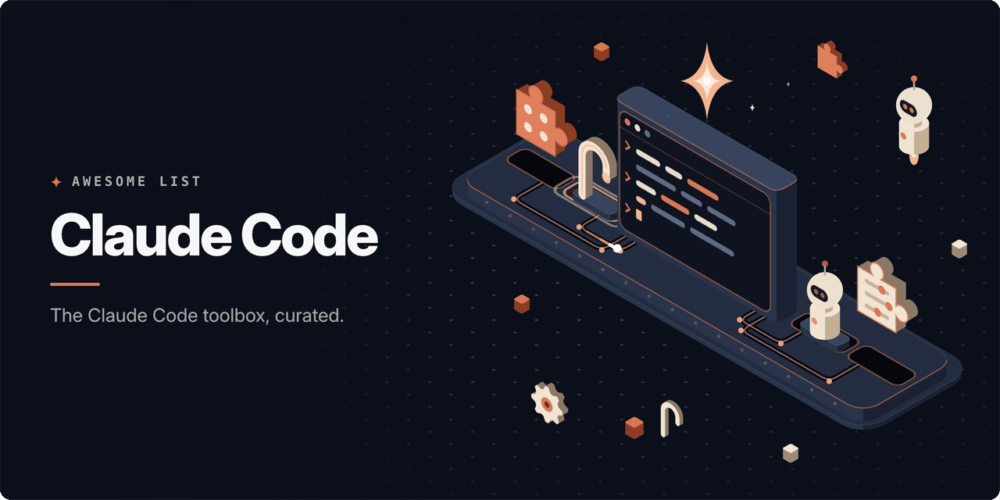

<!-- awesome:hero --><!-- /awesome:hero -->

<!-- awesome:title --><h1 align="center">Awesome Claude Code</h1><!-- /awesome:title -->

<!-- awesome:tagline -->A curated list of plugins, skills, hooks, subagents, mods, tools and guides for Claude Code, the coding agent from Anthropic.<!-- /awesome:tagline -->

<!-- awesome:badges -->

  
  
  

<!-- /awesome:badges -->

Every link was checked when it was added, and every GitHub project on the list has been active in the last year. Entries are sorted alphabetically within each section.

## Contents

- [Official resources](#official-resources)
- [Guides and tutorials](#guides-and-tutorials)
- [Plugins and marketplaces](#plugins-and-marketplaces)
  - [Marketplaces and directories](#marketplaces-and-directories)
  - [Plugins](#plugins)
- [Skills](#skills)
  - [Skill collections](#skill-collections)
  - [Development](#development)
  - [Design and frontend](#design-and-frontend)
  - [Writing](#writing)
  - [Research and data](#research-and-data)
  - [Business and productivity](#business-and-productivity)
  - [Media and diagrams](#media-and-diagrams)
  - [Skill tools](#skill-tools)
- [Subagents](#subagents)
- [Slash commands](#slash-commands)
- [Hooks](#hooks)
- [Output styles](#output-styles)
- [Status lines](#status-lines)
- [Mods](#mods)
- [MCP servers](#mcp-servers)
- [Routines](#routines)
- [Workflows and methods](#workflows-and-methods)
- [Orchestrators](#orchestrators)
- [Memory and context](#memory-and-context)
- [CLAUDE.md files and rules](#claudemd-files-and-rules)
- [Configuration](#configuration)
- [IDE integrations](#ide-integrations)
- [Clients and GUIs](#clients-and-guis)
- [Usage and monitoring](#usage-and-monitoring)
  - [Usage and cost](#usage-and-cost)
  - [Session monitoring](#session-monitoring)
- [Proxies and model routing](#proxies-and-model-routing)
- [Security and sandboxing](#security-and-sandboxing)
- [Testing and code review](#testing-and-code-review)
- [SDKs](#sdks)
- [Tools and utilities](#tools-and-utilities)

## Official resources

- [Agent Skills](https://github.com/anthropics/skills) - Anthropic's skill format, a template and sample skills that Claude Code loads as is.
- [Anthropic Documentation](https://docs.claude.com/en/home) - Documentation hub for Claude, its API and Claude Code.
- [Anthropic Quickstarts](https://github.com/anthropics/claude-quickstarts) - Starter apps from Anthropic for building on the Claude API.
- [Building Effective Agents](https://www.anthropic.com/research/building-effective-agents) - Anthropic's map of agent patterns such as routing and orchestrator-workers.
- [Claude Code Best Practices](https://code.claude.com/docs/en/best-practices) - Anthropic's advice on prompting, CLAUDE.md and day-to-day habits in Claude Code.
- [Claude Code Cheatsheet](https://support.claude.com/en/articles/14553413-claude-code-cheatsheet) - One-page reference for terms, built-in commands and key bindings.
- [Claude Code docs](https://code.claude.com/docs/en/overview) - The Claude Code documentation home.
- [Claude Code GitHub Action](https://github.com/anthropics/claude-code-action) - Runs Claude Code on issues and pull requests when someone mentions @claude.
- [Claude Code Security Review](https://github.com/anthropics/claude-code-security-review) - GitHub Action that reviews pull request diffs for security flaws.
- [claude-code](https://github.com/anthropics/claude-code) - The Claude Code repository, used for releases and issue tracking.
- [claude-cookbooks](https://github.com/anthropics/claude-cookbooks) - Notebooks with worked examples of Claude API features.
- [Computer Use from CLI](https://code.claude.com/docs/en/computer-use) - Docs for letting Claude Code operate desktop apps on macOS.
- [Effective Context Engineering for AI Agents](https://www.anthropic.com/engineering/effective-context-engineering-for-ai-agents) - Anthropic's guide to compaction, retrieval and notes for long agent runs.
- [financial-services](https://github.com/anthropics/financial-services) - Anthropic's agents, skills and data connectors for finance work.
- [How Claude Code Works](https://code.claude.com/docs/en/how-claude-code-works) - Explains the agent loop, built-in tools and how the context window fills.
- [How We Built Our Multi-Agent Research System](https://www.anthropic.com/engineering/multi-agent-research-system) - How Anthropic split research work across a lead agent and parallel subagents.
- [Steering Claude Code: Skills, Hooks, Rules, Subagents and More](https://claude.com/blog/steering-claude-code-skills-hooks-rules-subagents-and-more) - When to pick a skill, hook, rule or subagent, from the Claude team.

## Guides and tutorials

- [A Field Guide to Claude Fable 5](https://claude.com/blog/a-field-guide-to-claude-fable-finding-your-unknowns) - Anthropic post on finding what you do not know when working with Claude.
- [Agentic Workflow Patterns](https://github.com/ThibautMelen/agentic-ai-systems) - Agent patterns from Anthropic's writing, each as a runnable example with diagrams.
- [Auto Mode Engineering](https://www.anthropic.com/engineering/claude-code-auto-mode) - How auto mode decides which tool calls to approve.
- [Beyond the Prompt: Claude Code](https://arps18.github.io/posts/claude-code-mastery) - Dense blog guide to the parts of Claude Code that matter most.
- [Bring Your AI](https://bringyour.ai/claude-code-to-codex) - Guide to moving a Claude Code setup to Codex.
- [Claude Code Agent Teams: Exercises](https://github.com/panaversity/claude-code-agent-teams-exercises) - Hands-on exercises for agent teams.
- [Claude Code Documentation Mirror](https://github.com/ericbuess/claude-code-docs) - Mirror of the Claude Code docs, refreshed every few hours.
- [Claude Code Guide (web)](https://claudecodeguide.dev) - Plain-language guide from install to daily use.
- [Claude Code Guide (zebbern)](https://github.com/zebbern/claude-code-guide) - Single-page reference to setup, commands, hooks, MCP and subagents.
- [Claude Code Handbook](https://nikiforovall.blog/claude-code-rules) - Tips and practices for Claude Code, with plugins to install them.
- [Claude Code Hooks: Complete Guide](https://hidekazu-konishi.com/entry/claude_code_hooks_complete_guide.html) - Walks through every hook event with settings.json examples and pitfalls.
- [Claude Code Repos Index](https://github.com/danielrosehill/Claude-Code-Projects-Index) - Index of one author's Claude Code repos and starter templates.
- [Claude Code System Prompts](https://github.com/Piebald-AI/claude-code-system-prompts) - Extracted Claude Code system prompts and tool descriptions, tracked per release.
- [Claude Code Tips](https://github.com/ykdojo/claude-code-tips) - Many tips from basics to advanced, with a status line script.
- [Claude Code Ultimate Guide](https://github.com/FlorianBruniaux/claude-code-ultimate-guide) - Long guide with workflows, hooks, skills, MCP and quizzes.
- [Claude Code: Everything You Need to Know](https://github.com/wesammustafa/Claude-Code-Everything-You-Need-to-Know) - Primer on how Claude Code thinks, then setup, skills, hooks and agent teams.
- [claude-agentic-coding-playbook](https://github.com/john-wilmes/claude-agentic-coding-playbook) - Practices, config and install scripts backed by cited research.
- [claude-code-android](https://github.com/ferrumclaudepilgrim/claude-code-android) - Steps and scripts to run Claude Code on Android through Termux.
- [claude-code-cheat-sheet](https://cc.storyfox.cz) - Printable one-page reference, updated daily.
- [claude-code-mastery](https://github.com/TheDecipherist/claude-code-mastery) - Long guide to CLAUDE.md, hooks, skills, MCP and commands.
- [claude-code-memory-guide](https://github.com/Acteq1391gp/claude-code-memory-guide) - Guide to setting up persistent memory with hooks.
- [claude-code-wsl2-setup](https://github.com/congmnguyen/claude-code-wsl2-setup) - Scripts and notes for running Claude Code on WSL2.
- [claude-howto](https://github.com/luongnv89/claude-howto) - Chapter-by-chapter tutorial from first commands to plugins and hooks.
- [claudecode-best-practices](https://github.com/rosmur/claudecode-best-practices) - Notes on habits and procedures that work well with Claude Code.
- [Context Engineering 101](https://newsletter.victordibia.com/p/context-engineering-101-how-agents) - Short article on compaction, isolation and memory for agents.
- [Context Engineering Guide](https://www.anthropic.com/research/long-running-Claude) - Anthropic post on long-running Claude sessions for scientific computing.
- [Dispatch & Remote Control](https://claude.com/blog/dispatch-and-computer-use) - Anthropic post on running and scheduling Claude Code from phone or web.
- [Dive into Claude Code](https://github.com/VILA-Lab/Dive-into-Claude-Code) - Research paper that analyzes how Claude Code is built.
- [Encyclopedia of Agentic Coding Patterns](https://aipatternbook.com) - Free online book of patterns for AI-assisted software work.
- [explore-claude-code](https://github.com/LukeRenton/explore-claude-code) - Clickable sample project where each config file explains itself.
- [Learn Claude Code](https://github.com/shareAI-lab/learn-claude-code) - Builds a small Claude Code-like agent in Python, step by step.
- [Multi-Agent Orchestra](https://addyosmani.com/blog/code-agent-orchestra) - Addy Osmani's survey of ways to run several coding agents at once.
- [RAG Learning Academy](https://github.com/TakaGoto/rag-learning-academy) - Multi-agent Claude Code setup that teaches retrieval-augmented generation.
- [Shipping Real Code w/ Claude](https://diwank.space/field-notes-from-shipping-real-code-with-claude) - Blog post on one team's process for shipping with Claude.
- [Skills vs MCP vs Plugins](https://www.morphllm.com/context-engineering) - Compares skills, MCP and plugins and when to use each.
- [Writing a Good CLAUDE.md](https://www.humanlayer.dev/blog/writing-a-good-claude-md) - Essay on keeping CLAUDE.md short, layered and useful.

## Plugins and marketplaces

### Marketplaces and directories

- [AgentStore](https://github.com/techgangboss/agentstore) - Plugin marketplace where publishers can sell plugins for USDC.
- [Anthropic's marketplaces](https://code.claude.com/docs/en/plugins/anthropic-marketplaces) - Official docs listing Anthropic's plugin marketplaces and how to add each.
- [Build with Claude](https://github.com/davepoon/buildwithclaude) - Hub for finding skills, agents, commands, hooks and plugins.
- [Claude Code Skills](https://claude-skills.bt199.com) - Chinese directory of skills, agents and plugins.
- [claude-code-skills](https://github.com/daymade/claude-code-skills) - Marketplace of development skills.
- [ClaudoPro Directory](https://github.com/JSONbored/awesome-claude) - Registry of Claude agents, MCP servers, skills, hooks and commands.
- [n-skills](https://github.com/numman-ali/n-skills) - Small curated plugin marketplace.
- [Netresearch Agentic Skills](https://github.com/netresearch/claude-code-marketplace) - Marketplace of skills for AI-assisted development.
- [Observal](https://github.com/Observal/Observal) - Self-hosted registry for agent extensions with insights.
- [Official Plugin Directory](https://github.com/anthropics/claude-plugins-official) - Anthropic's curated plugin marketplace, installable from inside Claude Code.
- [Plugins overview](https://code.claude.com/docs/en/plugins/overview) - Official docs on what a plugin is and how to install, build and publish one.
- [protonium](https://github.com/protonium-labs/protonium-marketplace) - Small marketplace of agent and productivity plugins.
- [TokRepo](https://tokrepo.com) - Community-ranked registry of skills, MCP servers and configs.
- [tons-of-skills-marketplace](https://github.com/jeremylongshore/tons-of-skills-marketplace) - Skill and plugin marketplace with its own package manager.

### Plugins

- [AgentSys](https://github.com/agent-sh/agentsys) - Plugins and agents that automate the work around coding.
- [Claude Code Toolkit](https://github.com/rohitg00/awesome-claude-code-toolkit) - Marketplace of agents, skills, commands, hooks and rules.
- [claude-code-docs](https://github.com/costiash/claude-code-docs) - Keeps the current Claude Code docs searchable from inside a session.
- [claude-code-sessions](https://github.com/apappascs/claude-code-sessions) - Search and analyze sessions across all your projects.
- [claude-code-tools](https://github.com/pchalasani/claude-code-tools) - Tools for session search, handoff and continuity across coding CLIs.
- [claude-code-tresor](https://github.com/alirezarezvani/claude-code-tresor) - Skills, agents, commands and prompts in one collection.
- [claude-forge](https://github.com/sangrokjung/claude-forge) - One install of agents, commands, skills and safety hooks.
- [claude-ops](https://github.com/Lifecycle-Innovations-Limited/claude-ops) - Business assistant with skills and agents for inbox, CRM and ops work.
- [claude-rank](https://github.com/Houseofmvps/claude-rank) - Audits a site for AI search citation and fixes the files that help.
- [claude-sdlc-harness](https://github.com/BaseInfinity/claude-sdlc-harness) - Hooks and skills that enforce plan, test and review steps.
- [claude-workflow-v2](https://github.com/CloudAI-X/claude-workflow-v2) - Workflow plugin bundling agents, skills, hooks and commands.
- [claudekit](https://github.com/carlrannaberg/claudekit) - Commands, hooks and checkpoints for everyday work.
- [CloudBase AI Toolkit](https://github.com/TencentCloudBase/CloudBase-AI-Toolkit) - Plugin, skills and MCP server for Tencent CloudBase backends.
- [dodo-agent-plugin](https://github.com/dodopayments/dodo-agent-plugin) - Payment integration skills from Dodo Payments.
- [Everything Claude Code (ECC)](https://github.com/affaan-m/ECC) - Large harness of skills, memory, security checks and research-first workflows.
- [everything-claude-code](https://github.com/WorldFlowAI/everything-claude-code) - Agents, commands, skills, rules and hooks in one kit.
- [fractal](https://github.com/rmolines/fractal-loop) - Breaks goals into checkable pieces and tackles the riskiest first.
- [greatcto](https://github.com/avelikiy/great_cto) - Plugin with dozens of specialist agents that carry work from plan to release.
- [harness-evolver](https://github.com/raphaelchristi/harness-evolver) - Plugin that tunes an agent's prompts and routing through repeated trials.
- [knowledge-work-plugins](https://github.com/anthropics/knowledge-work-plugins) - Anthropic's plugins for knowledge work such as sales, legal and research.
- [mobile-spine](https://github.com/bentleypark/claude-code-mobile-spine) - Scaffolds a mobile meta-repo coordinated by four subagents.
- [MyVibe](https://www.myvibe.so) - Publishes a site from Claude Code with one command.
- [nirecom/agents](https://github.com/nirecom/agents) - Hook-driven harness with a review loop across two AI providers.
- [Omega](https://github.com/Omega-JS-Stack/omega/tree/main/agent-plugins/claude) - Skills, hooks and an MCP router for projects built on the Omega framework.
- [OSS Autopilot](https://github.com/costajohnt/oss-autopilot) - Tracks open source PRs and drafts replies to maintainers.
- [Pilot Shell](https://github.com/maxritter/pilot-shell) - Spec-driven harness with quality hooks for Claude Code and Codex.
- [plugins-for-claude-natives](https://github.com/team-attention/plugins-for-claude-natives) - Plugins for power users from Team Attention.
- [pro-workflow](https://github.com/rohitg00/pro-workflow) - Workflows that turn your corrections into lasting memory across sessions.
- [product-org-os](https://github.com/yohayetsion/product-org-os) - Skills and role agents that act as a product team.
- [production-grade](https://github.com/nagisanzenin/production-grade) - Autonomous pipeline of role agents for building a SaaS product.
- [showreel](https://github.com/HeyRenan/showreel) - Records annotated screenshots and short demo clips of your app for docs.
- [sonmat](https://github.com/jun0-ds/sonmat) - Builds verification habits into the agent's workflow.
- [spartan-ai-toolkit](https://github.com/c0x12c/ai-toolkit) - Commands, rules, skills and agents with quality gates.
- [SuperClaude](https://github.com/SuperClaude-Org/SuperClaude_Framework) - Framework of commands, personas and modes for Claude Code.
- [The Agentic Startup](https://github.com/rsmdt/the-startup) - Commands, skills and agents arranged as a startup team.
- [TÂCHES Claude Code Resources](https://github.com/glittercowboy/taches-cc-resources) - One author's set of subagents, skills and commands for daily work.
- [weft](https://github.com/dioptx/weft) - Tracks workflow state as events, with templates and a dashboard.
- [wshobson/agents](https://github.com/wshobson/agents) - Large marketplace of agents, skills and commands grouped into plugins.

## Skills

### Skill collections

- [9arm-skills](https://github.com/thananon/9arm-skills) - Personal skill set loaded by Claude Code.
- [agent-skills](https://github.com/addyosmani/agent-skills) - Addy Osmani's engineering skills for coding agents.
- [Agent-Skills-for-Context-Engineering](https://github.com/muratcankoylan/Agent-Skills-for-Context-Engineering) - Skills on context engineering and multi-agent design.
- [agent-toolkit](https://github.com/softaworks/agent-toolkit) - Curated skills for coding agents.
- [AuraKit](https://github.com/smorky850612/Aurakit) - All-in-one full-stack skill with modes, hooks and security layers.
- [baoyu-skills](https://github.com/JimLiu/baoyu-skills) - Skills for writing, images, slides and social publishing.
- [Caveman](https://github.com/JuliusBrussee/caveman) - Terse speaking style that cuts output tokens.
- [cc-thinking-skills](https://github.com/tjboudreaux/cc-thinking-skills) - Mental-model and critical-thinking skills with a router and published evals.
- [claude-skills (alirezarezvani)](https://github.com/alirezarezvani/claude-skills) - Large set of skills, agents and commands across many fields.
- [claude-skills (ckorhonen)](https://github.com/ckorhonen/claude-skills) - Skills for development, design and AI work.
- [Claudify](https://claudify.tech) - Packaged setup with many skills, agents and commands.
- [Context Engineering Kit](https://github.com/NeoLabHQ/context-engineering-kit) - Skills aimed at better agent results through context engineering.
- [davidondrej/skills](https://github.com/davidondrej/skills) - Personal skills for coding, research and docs.
- [dotai](https://github.com/udecode/dotai) - Skills and setup for an AI development stack.
- [Emdash Skills](https://github.com/heymegabyte/claude-skills) - Large skill set for building and deploying products.
- [faf-skills](https://github.com/Wolfe-Jam/faf-skills) - Skills that build and maintain project context files.
- [garden-skills](https://github.com/ConardLi/garden-skills) - Skills for web design, retrieval and image generation.
- [headcount](https://github.com/cbrock84/headcount) - Skills grouped like company departments.
- [Manus Skills](https://manus.im/blog/manus-skills) - Manus' post on its agent skills.
- [mattpocock skills](https://github.com/mattpocock/skills) - Matt Pocock's engineering skills from his own setup.
- [Superpowers](https://github.com/obra/superpowers) - Skills framework and method for test-driven, planned development.
- [thinking-tree](https://github.com/CoralLips/thinking-tree) - Thinking-framework skills arranged as a tree.
- [wondelai/skills](https://github.com/wondelai/skills) - Skills based on popular business, UX and coding books.

### Development

- [agent-skills (elastic)](https://github.com/elastic/agent-skills) - Elastic's official skills for its products.
- [Agent-Skills (MicrosoftDocs)](https://github.com/MicrosoftDocs/Agent-Skills) - Microsoft Docs skills for Microsoft and Azure work.
- [agent-skills (vercel-labs)](https://github.com/vercel-labs/agent-skills) - Vercel's official skills for coding agents.
- [agent-skills (WordPress)](https://github.com/WordPress/agent-skills) - WordPress's skills for blocks, themes and plugins.
- [agent-skills-standard](https://github.com/HoangNguyen0403/agent-skills-standard) - Skills with coding standards for many languages and frameworks.
- [agent-toolkit-for-aws](https://github.com/aws/agent-toolkit-for-aws) - AWS's official MCP servers, skills and plugins.
- [agents-best-practices](https://github.com/DenisSergeevitch/agents-best-practices) - Provider-neutral skill on designing agent harnesses.
- [agents-cli](https://github.com/google/agents-cli) - Google's CLI and skills for building agents on Google Cloud.
- [antfu's skills](https://github.com/antfu/skills) - Anthony Fu's skills for the Vue and Vite world.
- [app-store-connect-cli-skills](https://github.com/rorkai/app-store-connect-cli-skills) - Automates App Store Connect through its CLI.
- [app-store-preflight-skills](https://github.com/truongduy2611/app-store-preflight-skills) - Scans iOS and macOS projects for App Store rejection risks.
- [automotive-skills-suite](https://github.com/jherrodthomas/automotive-skills-suite) - Automotive engineering skills such as ISO 26262 safety.
- [aws-agent-skills](https://github.com/itsmostafa/aws-agent-skills) - Skills for core AWS services.
- [Axiom](https://github.com/CharlesWiltgen/Axiom) - Skills for iOS, watchOS and tvOS development.
- [azure-skills](https://github.com/microsoft/azure-skills) - Microsoft's Azure skills and MCP configs.
- [building-multiagent-systems](https://github.com/2389-research/building-multiagent-systems) - Skill on architecture patterns for multi-agent systems.
- [Callstack agent skills](https://github.com/callstackincubator/agent-skills) - Callstack's React Native skills.
- [cc-devops-skills](https://github.com/akin-ozer/cc-devops-skills) - Detailed DevOps skills with validators and generators.
- [cc-skills-golang](https://github.com/samber/cc-skills-golang) - Go skills by Samuel Berthe.
- [chrisbanes skills](https://github.com/chrisbanes/skills) - Chris Banes' skills for Kotlin, Compose and Android.
- [claude-skill-homeassistant](https://github.com/komal-SkyNET/claude-skill-homeassistant) - Manages Home Assistant setups.
- [cloudflare-skill](https://github.com/dmmulroy/cloudflare-skill) - Cloudflare platform reference written for agents.
- [Coware](https://github.com/shitianfang/coware-skills) - Keeps API specs in sync between several coding agents.
- [debian-packaging-agent-skill](https://github.com/cosgroveb/debian-packaging-agent-skill) - Skill for Debian packaging policy and tooling.
- [deployhq-cli](https://github.com/deployhq/deployhq-cli) - DeployHQ CLI with a Claude Code setup for deploys and rollbacks.
- [DevOps Agent](https://github.com/fullstackcrew-alpha/skill-devops-agent) - DevOps skill for deploys, backups and diagnosis.
- [Dimillian Skills](https://github.com/Dimillian/Skills) - Skills for Apple platforms, GitHub flow and refactoring.
- [dotnet-skills](https://github.com/Aaronontheweb/dotnet-skills) - .NET skills and subagents.
- [drizzle-best-practices](https://github.com/ofershap/drizzle-best-practices) - Drizzle ORM schema, relations and migration patterns.
- [ESP32-AI-Agent-Skill](https://github.com/ezrover/ESP32-AI-Agent-Skill) - Skills for ESP32 firmware, schematics and board layout.
- [expo-best-practices](https://github.com/ofershap/expo-best-practices) - Expo and React Native patterns for routing, builds and native modules.
- [Expo-Skills](https://github.com/expo/skills) - Expo's skills for Expo projects and EAS.
- [fable-mode](https://github.com/mrtooher/fable-mode) - Skill that pushes Claude into staged planning and subagent delegation.
- [fastapi-best-practices](https://github.com/ofershap/fastapi-best-practices) - FastAPI patterns for async code, dependencies and middleware.
- [Flutter agent plugins](https://github.com/flutter/agent-plugins) - Flutter's skills for app development.
- [flutter-best-practices](https://github.com/ofershap/flutter-best-practices) - Flutter and Dart 3 patterns that avoid deprecated APIs.
- [Fullstack Dev Skills](https://github.com/Jeffallan/claude-skills) - Dozens of skills for full-stack work across common frameworks.
- [Gear Foundation Skills](https://github.com/gear-foundation/vara-skills) - Skills for building Rust smart contracts on Vara.
- [gemini-skills](https://github.com/google-gemini/gemini-skills) - Google's skills for the Gemini API and SDKs.
- [getsentry/skills](https://github.com/getsentry/skills) - Skills the Sentry team uses in its own development.
- [GLM-skills](https://github.com/zai-org/GLM-skills) - Zhipu's official skills for its GLM models.
- [go-best-practices](https://github.com/ofershap/go-best-practices) - Go patterns for errors, concurrency, slog and newer language features.
- [godogen](https://github.com/htdt/godogen) - Builds Godot, Bevy and Babylon.js games from a design brief.
- [Google Agent Skills](https://github.com/google/skills) - Google's skills for its products and platforms.
- [hone-skills](https://github.com/ckorhonen/hone-skills) - Skills that run on a schedule to clean up naming and duplication.
- [huggingface skills](https://github.com/huggingface/skills) - Hugging Face skills for models, datasets and training.
- [iOS Simulator](https://github.com/conorluddy/ios-simulator-skill) - Builds and drives apps in the iOS Simulator.
- [ios-app-dev-skills](https://github.com/JasonColapietro/ios-app-dev-skills) - Skills for turning a website into an iOS app.
- [kotlin-agent-skills](https://github.com/Kotlin/kotlin-agent-skills) - JetBrains' skills for Kotlin projects.
- [langchain-skills](https://github.com/langchain-ai/langchain-skills) - LangChain's skills for LangChain projects.
- [Laravel agent skills](https://github.com/laravel/agent-skills) - Laravel's official agent skills for PHP work.
- [MiniMax-AI/skills](https://github.com/MiniMax-AI/skills) - MiniMax's development skills for coding agents.
- [modern-web-guidance](https://github.com/GoogleChrome/modern-web-guidance) - Google Chrome's guidance on current web practices.
- [n8n-skills](https://github.com/czlonkowski/n8n-skills) - Skills for building n8n workflows.
- [next-skills](https://github.com/vercel-labs/next-skills) - Vercel's skills for Next.js work.
- [nuxt-skills](https://github.com/onmax/nuxt-skills) - Skills for Vue, Nuxt and NuxtHub.
- [NVIDIA skills](https://github.com/NVIDIA/skills) - NVIDIA's skills for its robotics and AI products.
- [otelcol-doctor](https://github.com/s3onghyun/otelcol-doctor) - Writes and checks OpenTelemetry Collector configs.
- [python-best-practices](https://github.com/ofershap/python-best-practices) - Python 3.12+ patterns with type hints, Pydantic v2 and uv.
- [qovery-deploy](https://github.com/Qovery/qovery-skills) - Skills for deploying apps to Kubernetes with Qovery.
- [read-only-postgres](https://github.com/jawwadfirdousi/agent-skills) - Read-only PostgreSQL query skill with safety limits.
- [rtlify-ai](https://github.com/idanlevi1/rtlify) - Rules for right-to-left layouts in generated UI.
- [rust-skills](https://github.com/actionbook/rust-skills) - Rust skills organized around common problems.
- [shadcn-best-practices](https://github.com/ofershap/shadcn-best-practices) - shadcn/ui patterns for forms, theming and accessibility.
- [skills](https://github.com/microsoft/skills) - Microsoft's skills, MCP servers and agents for its SDKs.
- [solana-dev-skill](https://github.com/solana-foundation/solana-dev-skill) - Solana Foundation's skill for Solana development.
- [solid-skills](https://github.com/ramziddin/solid-skills) - Skill for SOLID, TDD and clean architecture.
- [Supabase agent skills](https://github.com/supabase/agent-skills) - Supabase's skills for building with Supabase.
- [sveltekit-best-practices](https://github.com/ofershap/sveltekit-best-practices) - Svelte 5 and SvelteKit patterns for load functions and form actions.
- [swe-skills](https://github.com/ckorhonen/swe-skills) - Engineering skills for PR risk, repo audits and ownership maps.
- [Swift-Concurrency-Agent-Skill](https://github.com/AvdLee/Swift-Concurrency-Agent-Skill) - Swift Concurrency guidance skill.
- [swift-ios-skills](https://github.com/dpearson2699/swift-ios-skills) - Skills for recent iOS, Swift and SwiftUI.
- [SwiftUI-Agent-Skill (AvdLee)](https://github.com/AvdLee/SwiftUI-Agent-Skill) - Antoine van der Lee's SwiftUI best practices skill.
- [SwiftUI-Agent-Skill (twostraws)](https://github.com/twostraws/SwiftUI-Agent-Skill) - Paul Hudson's SwiftUI skill.
- [tailwind-best-practices](https://github.com/ofershap/tailwind-best-practices) - Rules that keep agents on Tailwind CSS v4 syntax.
- [terraform-skill](https://github.com/antonbabenko/terraform-skill) - Terraform and OpenTofu skill for tests, modules and CI.
- [threejs-skills](https://github.com/CloudAI-X/threejs-skills) - Three.js skills for 3D scenes.
- [typescript-best-practices](https://github.com/ofershap/typescript-best-practices) - Current TypeScript patterns such as strict mode and discriminated unions.
- [vue-skills](https://github.com/vuejs-ai/skills) - Skills for Vue 3 development.
- [Waza](https://github.com/tw93/Waza) - Everyday engineering habits written as runnable skills.
- [webgpu-claude-skill](https://github.com/dgreenheck/webgpu-claude-skill) - WebGPU skill using Three.js.
- [Xcode-Build-Optimization-Agent-Skill](https://github.com/AvdLee/Xcode-Build-Optimization-Agent-Skill) - Benchmarks and speeds up Xcode builds.

### Design and frontend

- [ai-design-skills](https://github.com/elayadesign/ai-design-skills) - Design skills written as Markdown rules.
- [app-onboarding-questionnaire](https://github.com/adamlyttleapps/claude-skill-app-onboarding-questionnaire) - Designs questionnaire-style app onboarding.
- [Apple-Hig-Designer](https://github.com/axiaoge2/Apple-Hig-Designer) - Designs interfaces along Apple's Human Interface Guidelines.
- [appllama-skills](https://github.com/Appllama/appllama-skills) - Turns patterns from top apps into mobile screens.
- [awesome-design-skills](https://github.com/bergside/awesome-design-skills) - List of DESIGN.md and SKILL.md design files.
- [baoyu-design](https://github.com/JimLiu/baoyu-design) - Runs a Claude Design-like flow locally for mockups and decks.
- [calm-design](https://github.com/calmtiger86/calm-design) - Korean-first design agent for calm, plain UI.
- [cc-design](https://github.com/ZeroZ-lab/cc-design) - Guidance for high-fidelity HTML designs and prototypes.
- [claude-design-system-prompt](https://github.com/Trystan-SA/claude-design-system-prompt) - Design system prompt and skills for accessible UI.
- [design-extract](https://github.com/Manavarya09/design-extract) - Extracts a site's design system as tokens.
- [design-motion-principles](https://github.com/kylezantos/design-motion-principles) - Builds and audits UI motion.
- [design-plugin](https://github.com/0xdesign/design-plugin) - Helps make UI design choices through quick variations.
- [designer-skills](https://github.com/Owl-Listener/designer-skills) - Design skills and commands from research to UI systems.
- [effective-html](https://github.com/plannotator/effective-html) - Skills for HTML wireframes, prototypes and diagrams.
- [emilkowalski/skills](https://github.com/emilkowalski/skills) - Emil Kowalski's design engineering skills.
- [gsap-skills](https://github.com/greensock/gsap-skills) - GreenSock's official skills for GSAP animation.
- [hallmark](https://github.com/Nutlope/hallmark) - Design skill that avoids generic AI-looking UI.
- [interface-design](https://github.com/Dammyjay93/interface-design) - Design engineering plugin that keeps UI consistent.
- [ip-as-logo-skill](https://github.com/s1dashu/ip-as-logo-skill) - Generates simple rounded mascot logos.
- [jakubkrehel/skills](https://github.com/jakubkrehel/skills) - Skills for UI animation, polish and accessibility.
- [kill-ai-slop](https://github.com/yetone/kill-ai-slop) - Guide and skill that remove AI-looking tics from product UI and copy.
- [make-interfaces-feel-better](https://github.com/jakubkrehel/make-interfaces-feel-better) - Skill for the small details that make UI feel better.
- [material-3-skill](https://github.com/hamen/material-3-skill) - Material Design 3 components and tokens.
- [native-feel-skill](https://github.com/yetone/native-feel-skill) - Skill for desktop apps that feel native on each OS.
- [nothing-design-skill](https://github.com/dominikmartn/nothing-design-skill) - Generates UI in the Nothing design language.
- [Obsidian Theme Designer](https://github.com/XiangyuSu611/obsidian-theme-designer) - Designs Obsidian themes visually in the browser.
- [oil-motion](https://github.com/oil-oil/oil-motion) - Skill for web animation tied to scroll, drag and state.
- [repo-visuals](https://github.com/livlign/claude-skills/tree/main/plugins/repo-visuals) - Skills that design README hero images and audit READMEs.
- [scroll-world](https://github.com/oso95/scroll-world) - Turns a brand into a scrolling 3D landing page.
- [skill.color-expert](https://github.com/meodai/skill.color-expert) - Color science skill covering palettes and contrast rules.
- [Snip](https://github.com/rixinhahaha/snip) - Annotate screenshots and diagrams to show the agent what you mean.
- [stitch-skills](https://github.com/google-labs-code/stitch-skills) - Skills that work with Google's Stitch MCP server.
- [StitchFlow](https://github.com/yshishenya/stitchflow) - Turns prompts into UI directions, HTML and screenshots.
- [StyleSeed](https://github.com/bitjaru/styleseed) - Design method engine with skills for consistent visual choices.
- [taste-skill](https://github.com/Leonxlnx/taste-skill) - Skills that steer agents away from bland, generic UI and copy.
- [UI Craft](https://github.com/educlopez/ui-craft) - Design engineering skill for polished UI.
- [ui-design-brain](https://github.com/carmahhawwari/ui-design-brain) - UI component knowledge, layout patterns and design-system rules.
- [ui-skills](https://github.com/ibelick/ui-skills) - Skills for polishing interfaces built by agents.
- [ui-ux-pro-max-skill](https://github.com/nextlevelbuilder/ui-ux-pro-max-skill) - Design guidance skill with styles, palettes and UI rules.
- [ui-ux-suite](https://github.com/Aboudjem/ui-ux-suite) - Design audit that points to the exact line and value to fix.
- [ux](https://github.com/Laith0003/ux-skill) - Design linter that flags generic AI-looking UI.
- [ux-ui-agent-skills](https://github.com/plugin87/ux-ui-agent-skills) - Design system skill with tokens, components and WCAG checks.
- [visual-explainer](https://github.com/nicobailon/visual-explainer) - Builds HTML pages and slides that explain diffs, plans and data.
- [Web Assets Generator Skill](https://github.com/alonw0/web-asset-generator) - Generates favicons, app icons and social images.

### Writing

- [academic-humanizer](https://github.com/AIScientists-Dev/academic-humanizer) - Removes AI tells from papers and grant proposals.
- [academic-paper-skills](https://github.com/lishix520/academic-paper-skills) - Plans and writes academic papers.
- [ai-copywriter](https://github.com/mikiarlo3/ai-copywriter) - Copywriting skill with marketing knowledge.
- [ai-humanizer](https://github.com/ofershap/ai-humanizer) - Removes AI-sounding patterns from generated text and commits.
- [asd-ste100-skill](https://github.com/danyuchn/asd-ste100-skill) - Rewrites agent-facing English in Simplified Technical English.
- [autoprompt-skill](https://github.com/Spielewoy/autoprompt-skill) - Skill that rewrites prompts to reduce agent failures.
- [Avoid AI Writing](https://github.com/conorbronsdon/avoid-ai-writing) - Finds and rewrites AI writing patterns.
- [Book Factory](https://github.com/robertguss/claude-code-toolkit) - Skills that cover the steps of writing a nonfiction book.
- [Claude Style Patch](https://github.com/andrewroxby/claude-style-patch) - Drop-in CLAUDE.md block that reshapes Claude's prose style.
- [claude-blog](https://github.com/AgriciDaniel/claude-blog) - Blog writing skills with agents and quality gates.
- [Codebase to Course](https://github.com/zarazhangrui/codebase-to-course) - Skill that turns a codebase into an interactive one-page HTML course.
- [ELI5](https://github.com/DreambigOu/ELI5) - Explains anything at the right level for the reader.
- [humanizer](https://github.com/blader/humanizer) - Removes signs of AI-written text.
- [humanizer-skill](https://github.com/Aboudjem/humanizer-skill) - Finds and rewrites common AI writing patterns.
- [Markdown to EPUB](https://github.com/smerchek/claude-epub-skill) - Converts Markdown into EPUB books.
- [md2wechat](https://github.com/geekjourneyx/md2wechat-skill) - CLI and skill for formatting and posting Markdown articles to WeChat.
- [MDXG Redline](https://github.com/oubakiou/mdxg-redline) - Highlight-and-comment review of Markdown that exports notes as JSON for the agent.
- [naming](https://github.com/glacierphonk/naming) - Names products and brands using metaphor.
- [no-ai-slop](https://github.com/petergyang/no-ai-slop) - Editing skill that strips AI patterns but keeps your voice.
- [prompt-compression](https://github.com/ofershap/prompt-compression) - Compresses docs and prompts into fewer tokens for agent files.
- [prompt-master](https://github.com/nidhinjs/prompt-master) - Writes prompts for other AI tools.
- [readme-best-practices](https://github.com/ofershap/readme-best-practices) - Teaches agents to write READMEs that make people want to install.
- [Research-Paper-Writing-Skills](https://github.com/Master-cai/Research-Paper-Writing-Skills) - Skills for writing ML, CV and NLP papers.
- [screenwriting-skills](https://github.com/jtydhr88/screenwriting-skills) - Skills for screenwriting and television writing.
- [sepia](https://github.com/Nanako0129/sepia) - Skill that makes writing sound less machine-made.
- [SimpleEnglish](https://github.com/AminBlg/SimpleEnglish) - Writes docs in ASD-STE100 Simplified Technical English.
- [stop-slop](https://github.com/hardikpandya/stop-slop) - Skill file that removes AI tells from prose.
- [translate-book](https://github.com/deusyu/translate-book) - Translates whole books in PDF, DOCX or EPUB with parallel agents.
- [unslop](https://github.com/MohamedAbdallah-14/unslop) - Strips AI-sounding phrasing from text while leaving code alone.
- [x-article-publisher-skill](https://github.com/wshuyi/x-article-publisher-skill) - Publishes Markdown articles to X Articles.

### Research and data

- [academic-research-skills](https://github.com/Imbad0202/academic-research-skills) - Skills for the academic cycle from research to revision.
- [AI Research Skills](https://github.com/WenyuChiou/ai-research-skills) - Research skills for reviews, design and manuscripts.
- [AI-research-SKILLs](https://github.com/Orchestra-Research/AI-Research-SKILLs) - Skills for AI research and engineering work.
- [AlphaGBM/skills](https://github.com/AlphaGBM/skills) - Skills for real-time market data and stock research.
- [Auto-claude-code-research-in-sleep](https://github.com/wanshuiyin/Auto-claude-code-research-in-sleep) - Markdown skills for running ML research overnight.
- [Claude Mountaineering Skills](https://github.com/dreamiurg/claude-mountaineering-skills) - Researches mountain routes from several climbing sources.
- [Claude Scientific Skills](https://github.com/K-Dense-AI/scientific-agent-skills) - Large science skill library for biology, chemistry and data.
- [claude-deep-research-skill](https://github.com/199-biotechnologies/claude-deep-research-skill) - Deep research pipeline that scores source credibility.
- [claude-trading-skills](https://github.com/tradermonty/claude-trading-skills) - Skills for market analysis, charts and stock screens.
- [CSV Data Summarizer](https://github.com/coffeefuelbump/csv-data-summarizer-claude-skill) - Summarizes CSV files with statistics and charts.
- [Day1Global-Skills](https://github.com/star23/Day1Global-Skills) - Skills for US stocks, macro and crypto research.
- [deep-dive](https://github.com/kimsb2429/claude-skills) - Deep research skill that splits a question into a graph of subtasks.
- [Deep-Research-skills](https://github.com/Weizhena/Deep-Research-skills) - Deep research skill with human checkpoints.
- [dna-claude-analysis](https://github.com/shmlkv/dna-claude-analysis) - Explore your own genome data in conversation with Claude Code.
- [finance-skills](https://github.com/himself65/finance-skills) - Skills for financial analysis.
- [graphify](https://github.com/Graphify-Labs/graphify) - Turns code, docs and schemas into a knowledge graph you can query.
- [investorskills](https://github.com/questflowai/investorskills) - Investing judgment written as reusable skills.
- [iterationlayer/skills](https://github.com/iterationlayer/skills) - Skills for document extraction and image work.
- [last30days-skill](https://github.com/mvanhorn/last30days-skill) - Researches a topic across Reddit, X, YouTube and the web from the last month.
- [medical-research-skills](https://github.com/aipoch/medical-research-skills) - Skills for medical research protocols and analysis.
- [My Claude Code Setup](https://github.com/pedrohcgs/claude-code-my-workflow) - Template for academics using LaTeX, Beamer and R.
- [notebooklm-py](https://github.com/teng-lin/notebooklm-py) - Unofficial Python API and skill for NotebookLM.
- [obsidian-skills](https://github.com/kepano/obsidian-skills) - Skills for Obsidian's CLI, Markdown, Bases and Canvas formats.
- [paper2code](https://github.com/PrathamLearnsToCode/paper2code) - Turns an arXiv paper into working code.
- [power-bi-agentic-development](https://github.com/data-goblin/power-bi-agentic-development) - Power BI skills and agents.
- [qiaomu-anything-to-notebooklm](https://github.com/joeseesun/qiaomu-anything-to-notebooklm) - Sends many content types into NotebookLM.
- [qmd-skill](https://github.com/levineam/qmd-skill) - Skill for qmd local Markdown search.
- [SciAgent-Skills](https://github.com/jaechang-hits/SciAgent-Skills) - Bioinformatics and life science skills.
- [science-skills](https://github.com/google-deepmind/science-skills) - Google DeepMind's skills for scientific workflows.
- [skills-for-fabric](https://github.com/microsoft/skills-for-fabric) - Microsoft's skills and MCP setup for Microsoft Fabric.
- [tapestry](https://github.com/michalparkola/tapestry-skills) - Pulls articles, PDFs and video transcripts into notes.
- [tutor-skills](https://github.com/bevibing/tutor-skills) - Turns PDFs and code into Obsidian study vaults.
- [x-research-skill](https://github.com/rohunvora/x-research-skill) - Research skill for X threads with sourced briefs.
- [XVARY Stock Research](https://github.com/xvary-research/claude-code-stock-analysis-skill) - Stock research skill using SEC EDGAR and market data.

### Business and productivity

- [advertising-skills](https://github.com/realkimbarrett/advertising-skills) - Skills for direct response ads and funnels.
- [agentkit-seo](https://github.com/vitaecontext/vitaecontext) - Audits and improves GitHub profiles and repos for discovery.
- [ai-legal-claude](https://github.com/zubair-trabzada/ai-legal-claude) - Legal skills for contract review, NDAs and compliance.
- [ai-marketing-claude](https://github.com/zubair-trabzada/ai-marketing-claude) - Marketing skills with parallel subagents for audits and copy.
- [ai-marketing-skills](https://github.com/ericosiu/ai-marketing-skills) - Marketing skills for growth tests, sales and SEO.
- [ai-sales-team-claude](https://github.com/zubair-trabzada/ai-sales-team-claude) - Sales skills for prospect research and lead scoring.
- [aicoo-skills](https://www.aicoo.io) - Skills for sharing an agent by link and agent-to-agent messages.
- [aso-skills](https://github.com/appeeky/aso-skills) - App Store Optimization and app marketing skills.
- [awesome-pm-skills](https://github.com/menkesu/awesome-pm-skills) - Product skills from Lenny's Podcast.
- [BlogBurst](https://github.com/shensi8312/blogburst-claude-skill) - Skill that runs social media posting across several networks.
- [Bloom](https://github.com/Li-Evan/Bloom) - Tutor skill that writes a syllabus and adapts each lesson to your notes.
- [buyer-eval](https://github.com/salespeak-ai/buyer-eval-skill) - Evaluates B2B software vendors with evidence.
- [cheat-on-content](https://github.com/XBuilderLAB/cheat-on-content) - Treats each post as an experiment with scoring and review.
- [claude-ads](https://github.com/AgriciDaniel/claude-ads) - Paid ads skill across major ad platforms.
- [claude-code-marketing-skills](https://github.com/cognyai/claude-code-marketing-skills) - Skills for SEO audits and ad analysis.
- [claude-cs](https://github.com/nbashaw/claude-cs) - Builds customer support automation.
- [claude-office-skills](https://github.com/tfriedel/claude-office-skills) - Skills for creating and editing PPTX, DOCX, XLSX and PDF files.
- [claude-seo](https://github.com/AgriciDaniel/claude-seo) - SEO skill with sub-skills and agents for audits and schema.
- [CN Content Matrix](https://github.com/fullstackcrew-alpha/skill-cn-content-matrix) - Generates posts for Chinese social platforms.
- [Diffmode Growth Tactics](https://github.com/acogood/diffmode_free) - Growth tactics for startups, run as a plugin.
- [engram](https://github.com/nagisanzenin/engram) - Learning engine with recall checks and spaced review.
- [flyai-skill](https://github.com/alibaba-flyai/flyai-skill) - Alibaba Fliggy travel skill.
- [founder-toolkit](https://github.com/mooster/founder-toolkit) - Skills for investor updates, pitch decks and SaaS metrics.
- [geo-seo-claude](https://github.com/zubair-trabzada/geo-seo-claude) - AI search optimization skill with citability scoring.
- [Google Drive Memyard](https://github.com/zagmoai/public-google-drive) - Creates and edits Google Docs and Sheets.
- [gtm-engineer-skills](https://github.com/onvoyage-ai/gtm-engineer-skills) - Improves a site's AI search scores.
- [healthcare-agents](https://github.com/ajhcs/healthcare-agents) - Agent and skill pack for US healthcare admin work.
- [interview-coach-skill](https://github.com/noamseg/interview-coach-skill) - Interview coaching from job post to mock interview.
- [learn-faster-kit](https://github.com/hluaguo/learn-faster-kit) - Learning coach with spaced repetition and a personal syllabus.
- [learning-opportunities](https://github.com/DrCatHicks/learning-opportunities) - Skill that builds your own skills while you code with AI.
- [lenny-skills](https://github.com/RefoundAI/lenny-skills) - Product skills drawn from Lenny's Podcast.
- [linkedin-skills](https://github.com/sergebulaev/linkedin-skills) - Skills for writing LinkedIn posts and comments.
- [marketing-skills](https://github.com/irinabuht12-oss/marketing-skills) - Marketing skills for ads, SEO and AI visibility.
- [marketingskills](https://github.com/coreyhaines31/marketingskills) - Marketing skills for CRO, copy, SEO and analytics.
- [mortgage](https://github.com/lendtrain/mortgage) - Mortgage refinance pricing plugin.
- [notfair-plugin](https://github.com/nowork-studio/notfair-plugin) - SEO and ads skills that pull real Search Console and Google Ads data.
- [opc-skills](https://github.com/ReScienceLab/opc-skills) - Skills for solo founders.
- [paul-graham-skills](https://github.com/WinterDDo/paul-graham-skills) - Skills drawn from Paul Graham's essays.
- [planmysaas](https://github.com/creationskiro/planmysaas-claude-skill) - Turns a SaaS idea into a set of planning documents.
- [PM Pilot](https://github.com/mshadmanrahman/pm-pilot) - Product management skills for discovery, PRDs and prep.
- [pm-claude-skills](https://github.com/mohitagw15856/pm-claude-skills) - Large set of professional skills for documents and tasks.
- [Product Manager Skills](https://github.com/Digidai/product-manager-skills) - Product skills for metrics, roadmaps and PRD review.
- [Product-Manager-Skills](https://github.com/deanpeters/Product-Manager-Skills) - Product management skills built on known methods.
- [Pulse](https://septimlabs.com/pulse?utm_source=awesome-list&utm_campaign=ccplugins) - Subagent that scores X drafts against the published ranking code.
- [pumpclaw](https://github.com/chainstacklabs/pumpclaw) - Trading skill for pump.fun tokens.
- [Reepl - LinkedIn Content Creation](https://github.com/reepl-io/skills) - Skills for drafting and scheduling LinkedIn posts.
- [ResumeSkills](https://github.com/Paramchoudhary/ResumeSkills) - Skills for resumes and job applications.
- [SenseNova-Skills](https://github.com/OpenSenseNova/SenseNova-Skills) - SenseNova skills for office assistant work.
- [seomachine](https://github.com/TheCraigHewitt/seomachine) - Workspace for writing long SEO blog posts.
- [slavingia/skills](https://github.com/slavingia/skills) - Skills based on The Minimalist Entrepreneur.
- [social-media-research-skills](https://github.com/ScrapeCreators/social-media-research-skills) - Skills for social media research and ad libraries.
- [social-media-skills](https://github.com/charlie947/social-media-skills) - Skills for planning and writing social media content.
- [solo-founder-skills](https://github.com/whawkinsiv/solo-founder-skills) - Skills for solo founders building SaaS with AI tools.
- [SuperSEO Skills](https://github.com/inhouseseo/superseo-skills) - SEO skills for audits, link building and content gaps.
- [the-pragmatic-pm](https://github.com/marfoerst/the-pragmatic-pm) - Skills, agents and workflows for product managers.
- [x-skills](https://github.com/sergebulaev/x-skills) - Skills for writing tweets, threads and replies in your own voice.
- [x-twitter-scraper](https://github.com/Xquik-dev/x-twitter-scraper) - X data API with an agent skill and MCP server.

### Media and diagrams

- [agent-sprite-forge](https://github.com/0x0funky/agent-sprite-forge) - Generates sprite sheets, maps and animated GIFs.
- [archify](https://github.com/tt-a1i/archify) - Draws architecture, sequence and data-flow diagrams.
- [architecture-diagram-generator](https://github.com/Cocoon-AI/architecture-diagram-generator) - Draws architecture diagrams as standalone HTML or SVG.
- [banana-claude](https://github.com/AgriciDaniel/banana-claude) - Image generation skill driven by Gemini.
- [bibigpt-skill](https://github.com/JimmyLv/bibigpt-skill) - Summarizes videos and podcasts through BibiGPT.
- [blender-kiln](https://github.com/elithril/blender-kiln) - Blender pipeline from text brief to a GLB asset.
- [bolt-slides](https://github.com/stackblitz/bolt-slides) - StackBlitz's React slides framework with an agent skill.
- [capcut-cli](https://github.com/renezander030/capcut-cli) - Edits CapCut and JianYing project files from the command line.
- [claude-code-voice-skill](https://github.com/abracadabra50/claude-code-voice-skill) - Phone the agent and talk through your projects.
- [claude-real-video](https://github.com/HUANGCHIHHUNGLeo/claude-real-video) - Lets an LLM watch a video through frames and a transcript.
- [claude-skill-aso-appstore-screenshots](https://github.com/adamlyttleapps/claude-skill-aso-appstore-screenshots) - Plans and produces App Store screenshot sets.
- [claude-video](https://github.com/bradautomates/claude-video) - Lets Claude watch a video by pulling frames and a transcript.
- [codex-ppt-skill](https://github.com/ningzimu/codex-ppt-skill) - Builds image-based PowerPoint decks with GPT Image.
- [D3.js Visualization](https://github.com/chrisvoncsefalvay/claude-d3js-skill) - Builds interactive D3.js charts.
- [Diagram Design](https://github.com/cathrynlavery/diagram-design) - Editorial diagrams in many types as standalone HTML and SVG.
- [drawio-skill](https://github.com/Agents365-ai/drawio-skill) - Generates draw.io diagrams from text, code and infra files.
- [dream-loop](https://github.com/achimala/dream-loop) - Builds 3D scenes with Blender, image models and a critic agent.
- [elevenlabs skills](https://github.com/elevenlabs/skills) - ElevenLabs skills for speech and sound.
- [excalidraw-diagram-skill](https://github.com/coleam00/excalidraw-diagram-skill) - Draws Excalidraw diagrams.
- [ffmpeg-skill](https://github.com/kajisho5/ffmpeg-skill) - FFmpeg skill for video and audio edits.
- [fireworks-tech-graph](https://github.com/yizhiyanhua-ai/fireworks-tech-graph) - Draws technical diagrams as SVG and PNG from text.
- [frontend-slides](https://github.com/zarazhangrui/frontend-slides) - Builds animated slide decks as web pages.
- [GPT-Image2-Skill](https://github.com/wuyoscar/GPT-Image2-Skill) - OpenAI image prompts, a skill and a CLI for making and editing images.
- [guizang-ppt-skill](https://github.com/op7418/guizang-ppt-skill) - Generates HTML slide decks in magazine and Swiss layouts.
- [guizang-social-card-skill](https://github.com/op7418/guizang-social-card-skill) - Generates Xiaohongshu carousels and WeChat covers.
- [Higgsfield AI Skills](https://github.com/higgsfield-ai/skills) - Higgsfield skills for image and video generation.
- [html-anything](https://github.com/clockless-org/html-anything) - Turns files, exports and logs into interactive HTML pages.
- [html-ppt-skill](https://github.com/lewislulu/html-ppt-skill) - HTML presentation skill with themes, layouts and animations.
- [html-report](https://github.com/panhongwei/html-report) - Skill that builds slide-style HTML pages from a short prompt.
- [hyperframes](https://github.com/heygen-com/hyperframes) - HeyGen framework for rendering video from HTML, made for agents.
- [logo-generator-skill](https://github.com/op7418/logo-generator-skill) - Generates SVG logos with showcase pages.
- [lottie](https://github.com/diffusionstudio/lottie) - Generates Lottie animations.
- [manimskill](https://github.com/adithya-s-k/manim_skill) - Manim skills for math animations.
- [markdown-viewer skills](https://github.com/markdown-viewer/skills) - Skills for diagrams and charts written in Markdown.
- [mono-color-skill](https://github.com/yanliudesign/mono-color-skill) - Image skill for one-ink editorial print styles.
- [motion-skills](https://github.com/iart-ai/motion-skills) - Skills for motion graphics and kinetic type.
- [nano-banana](https://github.com/Ibrahim-3d/nano-banana-claude-plugin) - Gemini image generation and editing plugin.
- [nano-banana-pro-prompts-recommend-skill](https://github.com/YouMind-OpenLab/nano-banana-pro-prompts-recommend-skill) - Recommends Nano Banana Pro image prompts from a large library.
- [nano-image-generator-skill](https://github.com/lxfater/nano-image-generator-skill) - Image generation with Gemini.
- [Pika-Skills](https://github.com/Pika-Labs/Pika-Skills) - Skills that use the Pika video API.
- [pireel](https://github.com/pireel/pireel) - Browser video editor that agents can drive over MCP.
- [PPT-Design-Skill](https://github.com/sunchaokun/PPT-Design-Skill) - PowerPoint design skill with many styles.
- [ppt-image-first](https://github.com/NyxTides/ppt-image-first) - Image-first PowerPoint skill.
- [Pretty-mermaid-skills](https://github.com/imxv/Pretty-mermaid-skills) - Renders Mermaid diagrams as themed SVG or ASCII.
- [readme-demo-recorder](https://github.com/cjcsecurity/readme-demo-recorder) - Records scripted browser demos as MP4 and GIF.
- [remotion-dev/skills](https://www.remotion.dev/docs/ai/skills) - Remotion's skills for making videos in code.
- [seedance-prompt-skill](https://github.com/songguoxs/seedance-prompt-skill) - Writes Seedance 2.0 video prompts.
- [seedance2-skill](https://github.com/dexhunter/seedance2-skill) - Writes prompts for Seedance 2.0 video generation.
- [story-to-handdrawn-video](https://github.com/gnipbao/story-to-handdrawn-video) - Turns story text or images into a hand-drawn comic video.
- [taisly-agent-kit](https://github.com/taisly/agent) - MCP server, CLI and docs for posting videos to social platforms.
- [text-to-cad](https://github.com/earthtojake/text-to-cad) - Harness for generating CAD models.
- [Vox director skill](https://github.com/Alisa0808/vox-director) - Makes Vox-style collage explainer videos from a topic.
- [Youtube-clipper-skill](https://github.com/op7418/Youtube-clipper-skill) - Downloads, chapters and clips YouTube videos with subtitles.

### Skill tools

- [agent-skills-platform](https://github.com/FrancyJGLisboa/agent-skills-platform) - Builds and tests skills and manages them in a marketplace.
- [agentic-awesome-skills](https://github.com/sickn33/agentic-awesome-skills) - Large skill catalog with a local tool for picking and checking skills.
- [asm](https://github.com/luongnv89/asm) - Skill manager for many coding agents.
- [autoharness](https://github.com/tigerless-labs/autoharness) - Distills new skills from your real sessions.
- [book-to-skill](https://github.com/virgiliojr94/book-to-skill) - Turns a technical book PDF into a skill.
- [chops](https://github.com/Shpigford/chops) - macOS app for browsing and editing skills across agents.
- [claude-code-skill-factory](https://github.com/alirezarezvani/claude-code-skill-factory) - Toolkit for building and shipping Claude skills.
- [claude-skills-supercharged](https://github.com/jefflester/claude-skills-supercharged) - Adds skill scoring and auto-activation using Haiku.
- [Claudeception](https://github.com/blader/Claudeception) - Lets Claude write new skills from what it learns while working.
- [ClawSearch](https://clawsearch.cc) - Skill search engine with trust scores and an install guard.
- [j4rk0r/claude-skills](https://github.com/j4rk0r/claude-skills) - Skills that vet and recommend other skills.
- [manage-skills](https://github.com/umutbozdag/agent-skills-manager/tree/main/skills/manage-skills) - Dashboard skill for managing skills across agents.
- [Memento-Skills](https://github.com/Memento-Teams/Memento-Skills) - Skills that help agents design other agents.
- [openskills](https://github.com/numman-ali/openskills) - Skills loader that installs skills into many coding agents.
- [pulser](https://github.com/TheStack-ai/pulser) - Linter that checks and fixes SKILL.md files against Anthropic guidance.
- [self-learning-skills](https://github.com/Kulaxyz/self-learning-skills) - Saves a hard-won fix from a session as a reusable skill.
- [skill-builder](https://github.com/Scottpedia0/skill-builder) - Studies your work and suggests a new skill each day.
- [SkillClaw](https://github.com/AMAP-ML/SkillClaw) - Lets a group of agents evolve and improve shared skills.
- [SkillForge](https://github.com/tripleyak/SkillForge) - Creates skills and tests them against a baseline.
- [skillhub-desktop](https://github.com/skillhub-club/skillhub-desktop) - Desktop app for managing agent skills.
- [skillkit](https://github.com/rohitg00/skillkit) - Installs, converts and shares skills across agents.
- [SkillNav](https://github.com/skillnav-dev/skillnav-skill) - Chinese-language skill for finding MCP servers and tools.
- [skillpack](https://github.com/CreminiAI/skillpack) - Packs and deploys local agents and skill packs for a team.
- [Skills docs](https://code.claude.com/docs/en/skills) - Official docs on creating, sharing and managing skills.
- [skills-janitor](https://github.com/khendzel/skills-janitor) - Audits, dedupes and tracks usage of installed skills and agents.
- [skills-manager](https://github.com/xingkongliang/skills-manager) - Desktop app to sync skills across many coding tools.
- [skillshare](https://github.com/runkids/skillshare) - Syncs skills across agent CLIs and teams.
- [SkillSpec](https://github.com/modiqo/skillspec) - CLI that makes skills testable with risk reports.
- [Superpower Builder](https://github.com/redhuntlabs/wizard) - Turns recurring tasks into reusable skills.
- [Vercel skills CLI](https://github.com/vercel-labs/skills) - Vercel's npx skills CLI for installing skills from any repo.
- [Vibe-Skills](https://github.com/foryourhealth111-pixel/Vibe-Skills) - Routes tasks to the right skill and workflow.

## Subagents

- [A List of Claude Code Agents](https://github.com/hesreallyhim/a-list-of-claude-code-agents) - Community list of Claude Code subagents.
- [agent-triforce](https://github.com/ArtemioPadilla/agent-triforce) - Three agents for planning, building and QA with checklists.
- [awesome-claude-agents](https://github.com/vijaythecoder/awesome-claude-agents) - Team of subagents with an orchestrator.
- [awesome-claude-code-subagents](https://github.com/VoltAgent/awesome-claude-code-subagents) - Large collection of subagents by domain.
- [cartographer](https://github.com/kingbootoshi/cartographer) - Maps and documents a large codebase with parallel subagents.
- [Claude Code Agents](https://github.com/undeadlist/claude-code-agents) - Subagent prompts for parallel audits and fix cycles.
- [Claude-Code-Game-Studios](https://github.com/Donchitos/Claude-Code-Game-Studios) - Game studio setup with many agents and workflow skills.
- [claude-code-subagents](https://github.com/0xfurai/claude-code-subagents) - Large set of development subagents.
- [ClaudeCodeAgents](https://github.com/darcyegb/ClaudeCodeAgents) - QA subagents for Claude Code.
- [dotclaude](https://github.com/FradSer/dotclaude) - Agents for review, security and tech leadership.
- [Harness](https://github.com/revfactory/harness) - Meta-skill that designs a team of agents and their skills.
- [launch-swarm](https://github.com/harshmoney123/launch-swarm) - A .claude folder with six role agents for a small startup.
- [qa-orchestra](https://github.com/Anasss/qa-orchestra) - Ten QA agents that go from a diff to a written bug report.
- [review-squad](https://github.com/2389-research/review-squad) - Sends panels of review subagents over a project from different angles.
- [simmer](https://github.com/2389-research/simmer) - Refines a piece of work in rounds with a board of judge subagents.
- [sub-agents.directory](https://github.com/ayush-that/sub-agents.directory) - Directory of subagent prompts and MCP servers.
- [Subagents docs](https://code.claude.com/docs/en/sub-agents) - Official docs on defining custom subagents.
- [test-kitchen](https://github.com/2389-research/test-kitchen) - Builds several versions of a feature at once and lets tests pick one.

## Slash commands

- [/cht](https://github.com/kosoukhov/cht-cli) - Commands and hooks that save and resume chats as Markdown files.
- [/commit](https://github.com/evmts/tevm/blob/main/.claude/commands/commit.md) - Writes conventional commits.
- [/context-prime](https://github.com/elizaOS/elizaos.github.io/blob/main/.claude/commands/context-prime.md) - Loads a project overview into context.
- [/create-command](https://github.com/scopecraft/command/blob/main/.claude/commands/create-command.md) - Helps write new slash commands.
- [/create-hook](https://github.com/omril321/automated-notebooklm/blob/main/.claude/commands/create-hook.md) - Command that helps write a new hook.
- [/create-plan](https://github.com/hesreallyhim/inkverse-fork/blob/preserve-claude-resources/.claude/commands/create-plan.md) - Writes an implementation plan.
- [/create-pr](https://github.com/toyamarinyon/giselle/blob/main/.claude/commands/create-pr.md) - Opens a pull request with a filled-in description.
- [/create-prp](https://github.com/Wirasm/dylan/blob/main/.claude/commands/create-prp.md) - Writes a product requirement plan from a template.
- [/create-pull-request](https://github.com/liam-hq/liam/blob/main/.claude/commands/create-pull-request.md) - Creates pull requests in a consistent format.
- [/create-worktrees](https://github.com/evmts/tevm/blob/main/.claude/commands/create-worktrees.md) - Creates a git worktree for each open pull request.
- [/docs](https://github.com/slunsford/coffee-analytics/blob/main/.claude/commands/docs.md) - Writes docs that follow the project layout.
- [/fix-github-issue](https://github.com/jeremymailen/kotlinter-gradle/blob/master/.claude/commands/fix-github-issue.md) - Reads a GitHub issue and fixes it.
- [/fix-issue](https://github.com/metabase/metabase/blob/master/.claude/commands/fix-issue.md) - Metabase's command for fixing an issue.
- [/fix-pr](https://github.com/metabase/metabase/blob/master/.claude/commands/fix-pr.md) - Metabase's command for fixing a pull request.
- [/fixinggoingraph](https://github.com/Mjvolk3/torchcell/blob/main/.claude/commands/fixing_go_in_graph.md) - Focused command for fixing a graph data step.
- [/husky](https://github.com/evmts/tevm/blob/main/.claude/commands/husky.md) - Sets up Husky git hooks.
- [/initref](https://github.com/okuvshynov/cubestat/blob/main/.claude/commands/initref.md) - Loads reference docs into context.
- [/linux-desktop-slash-commands](https://github.com/danielrosehill/Claude-Code-Linux-Desktop-Slash-Commands) - Slash commands for Linux desktop admin.
- [/load-llms-txt](https://github.com/ethpandaops/xatu-data/blob/master/.claude/commands/load-llms-txt.md) - Loads an llms.txt file into context.
- [/loadcoocontext](https://github.com/Mjvolk3/torchcell/blob/main/.claude/commands/load_coo_context.md) - Loads a project's data model context.
- [/loaddangopipeline](https://github.com/Mjvolk3/torchcell/blob/main/.claude/commands/load_dango_pipeline.md) - Loads a specific pipeline's context.
- [/prd-generator](https://github.com/dredozubov/prd-generator) - Plugin that writes product requirements documents.
- [/release](https://github.com/kelp/webdown/blob/main/.claude/commands/release.md) - Runs a release with version and changelog updates.
- [/reviewdcellmodel](https://github.com/Mjvolk3/torchcell/blob/main/.claude/commands/review_dcell_model.md) - Reviews an older model implementation against a newer one.
- [/update-branch-name](https://github.com/giselles-ai/giselle/blob/main/.claude/commands/update-branch-name.md) - Renames a branch with the right prefix.
- [/update-docs](https://github.com/Consiliency/Flutter-Structurizr/blob/main/.claude/commands/update-docs.md) - Reviews and updates project docs.
- [Blogging Platform Instructions](https://github.com/cloudartisan/cloudartisan.github.io/tree/main/.claude/commands) - Commands for writing and publishing posts on a static blog.
- [claude-cmd](https://github.com/kiliczsh/claude-cmd) - Manager for installing and organizing slash commands.
- [Claude-Command-Suite](https://github.com/qdhenry/Claude-Command-Suite) - Slash commands for reviews, security and planning.
- [Project Management, Implementation, Planning, and Release](https://github.com/scopecraft/command/tree/main/.claude/commands) - Commands for planning, task tracking and releases.
- [Project Workflow System](https://github.com/harperreed/dotfiles/tree/master/.claude/commands) - Harper Reed's commands for planning and running work.

## Hooks

- [agent-notifications](https://github.com/777genius/agent-notifications) - Desktop and webhook notifications for Claude Code and similar CLIs.
- [Bouncer](https://github.com/buildingopen/bouncer) - Stop hook that has Gemini audit Claude's work before it can finish.
- [Britfix](https://github.com/Talieisin/britfix) - Hook that converts American spellings to British English.
- [call-me](https://github.com/ZeframLou/call-me) - Lets Claude Code phone you when it needs input.
- [CC Notify](https://github.com/dazuiba/CCNotify) - Desktop notifications when Claude needs input or finishes.
- [cc-discipline](https://github.com/TechHU-GS/cc-discipline) - Shell hooks that stop edit loops and skipped checks.
- [cc-safe-setup](https://github.com/yurukusa/cc-safe-setup) - One command installs safety hooks that block destructive commands.
- [cchooks](https://github.com/GowayLee/cchooks) - Python SDK for writing hooks.
- [Claude Code Tamagotchi](https://github.com/Ido-Levi/claude-code-tamagotchi) - Pet that watches Claude's actions and stops rule breaks.
- [claude-code-boost](https://github.com/yifanzz/claude-code-boost) - Hook tools with smart auto-approval.
- [claude-code-hooks (karanb192)](https://github.com/karanb192/claude-code-hooks) - Hooks and a plugin marketplace for safety, cost and logging.
- [claude-code-hooks (yurukusa)](https://github.com/yurukusa/claude-code-hooks) - Safety hooks from long autonomous runs.
- [claude-code-hooks-mastery](https://github.com/disler/claude-code-hooks-mastery) - Examples and guide for every hook event, written as Python scripts.
- [claude-code-notifier](https://github.com/saiso/claude-code-notifier) - macOS notifier with click-through to the IDE.
- [claude-code-prompt-improver](https://github.com/severity1/claude-code-prompt-improver) - Hook that rewrites vague prompts before they run.
- [claude-hooks-sdk](https://github.com/beyondcode/claude-hooks-sdk) - PHP SDK for building hook responses.
- [claude-sounds](https://github.com/culminationAI/claude-sounds) - Plays sounds on key Claude Code events.
- [claude-time](https://github.com/nexusbuildsai/claude-time) - Adds the current local time and timezone to every prompt.
- [Claudio](https://github.com/ctoth/claudio) - Plays system sounds on hook events.
- [clooks](https://github.com/mauribadnights/clooks) - Persistent hook runtime that removes cold starts.
- [Hooks guide](https://code.claude.com/docs/en/hooks-guide) - Official guide to running commands on Claude Code events.
- [idle-timing](https://github.com/clankercode/claude-inject-idle-time) - Adds the local time and idle gap to each prompt in a few tokens.
- [notify](https://github.com/ApurvBazari/claude-plugins) - Desktop notifications for Claude Code hook events.
- [obey](https://github.com/Lexxes-Projects/obey) - Saves rules in plain words and enforces them with hooks.
- [peon-ping](https://github.com/PeonPing/peon-ping) - Plays game voice lines when your coding agent needs you.
- [prompt-chime](https://github.com/pick/prompt-chime) - Notifications with sound presets and quiet hours.
- [smart-approve.py](https://github.com/liberzon/claude-hooks) - PreToolUse hook that splits compound bash commands and checks each part.
- [steward](https://github.com/joshsymonds/steward) - Go hooks for linting, testing and status line output.
- [TDD Guard](https://github.com/nizos/tdd-guard) - Hooks that block changes that break test-driven development.
- [temporal-core](https://github.com/Evanyuan-builder/temporal-core) - Hooks and a skill that give agents a sense of elapsed time.
- [think-first](https://github.com/ofershap/think-first) - Makes the agent plan before it writes code.

## Output styles

- [awesome-claude-code-output-styles-that-i-really-like](https://github.com/hesreallyhim/awesome-claude-code-output-styles-that-i-really-like) - Hand-picked set of output styles.
- [cc-output-style](https://github.com/kohaku4yz/cc-output-style) - Short guide to writing an output style.
- [claude-code-output-styles (jensensics)](https://github.com/jensensics/claude-code-output-styles) - Guide to writing custom output styles.
- [claude-code-output-styles (nattergabriel)](https://github.com/nattergabriel/claude-code-output-styles) - Collection of custom output styles.
- [claude-ste100-output-styles](https://github.com/TPOW-001/claude-ste100-output-styles) - Output styles in Simplified Technical English.
- [dyslexic-claude](https://github.com/schananas/dyslexic-claude) - Output style for readers who find long text costly.
- [fluent-korean](https://github.com/snflkd/fluent-korean) - Output style plugin for clear, natural Korean replies.
- [Katharsis](https://github.com/OpenScribbler/Katharsis) - Output style that sorts each message and shapes the reply to fit.
- [Output styles docs](https://code.claude.com/docs/en/output-styles) - Official docs on changing how Claude Code writes its replies.

## Status lines

- [cc-costline](https://github.com/Ventuss-OvO/cc-costline) - Status line showing your spend over 7 and 30 days.
- [cc-hud](https://github.com/WaterTian/cc-hud) - Compact status line that works on Windows.
- [cc-probeline](https://github.com/labzink/cc-probeline) - Status line that prices each turn and subagent.
- [cc-statusline](https://github.com/chongdashu/cc-statusline) - Generates an informative status line config.
- [cc-tempo](https://github.com/O0000-code/cc-tempo) - Status line that measures work time and subagent speedup.
- [CCometixLine](https://github.com/Haleclipse/CCometixLine) - Fast status line in Rust with git details.
- [ccstatusline](https://github.com/sirmalloc/ccstatusline) - Customizable status line with powerline styles and themes.
- [ccvitals](https://github.com/educlopez/ccvitals) - Pure bash status line with quota, context and git.
- [Claude HUD](https://github.com/jarrodwatts/claude-hud) - Plugin that shows context use, active tools, agents and todos.
- [claude-code-personalities](https://github.com/kumamaki/Claude-Code-Personalities) - Kaomoji faces in the status line that change with Claude's activity.
- [claude-code-status-bar](https://github.com/briansmith80/claude-code-status-bar) - Status bar with pacing markers for usage limits, context and git.
- [claude-code-statusline](https://github.com/rz1989s/claude-code-statusline) - Status line with flexible layouts and cost tracking.
- [claude-dashboard](https://github.com/uppinote20/claude-dashboard) - Status line with context use, rate limits and cost.
- [claude-pace](https://github.com/Astro-Han/claude-pace) - Bash and jq status line that tracks quota pace.
- [claude-powerline](https://github.com/Owloops/claude-powerline) - Vim-style powerline status line with usage tracking.
- [claude-statusbar](https://github.com/leeguooooo/claude-code-usage-bar) - Status line with rate-limit use, reset timers and context size.
- [ClaudeCodeStatusLine](https://github.com/daniel3303/ClaudeCodeStatusLine) - Status line with model, tokens, rate limits and git.
- [claudia-statusline](https://github.com/hagan/claudia-statusline) - Rust status line that detects compaction and stores sessions.
- [codachi](https://github.com/vincent-k2026/codachi) - Virtual pet in the status line that grows with context use.
- [context-stats](https://github.com/luongnv89/context-stats) - Status line and stats on how you use Claude Code.
- [craft-statusline](https://github.com/derjochenmeyer/claude-code-craft-statusline) - Minimal bash status line showing model, effort and context.
- [Status line docs](https://code.claude.com/docs/en/statusline) - Official docs on building a custom status line.
- [TermaGITchi](https://github.com/TevvvB/termagitchi) - A small creature per git worktree in the status line.
- [tmux-claude-status-tabs](https://github.com/LiveNL/tmux-claude-status-tabs) - Shows each session's state in your tmux tab bar.

## Mods

- [awesome-claude-code-mods](https://github.com/karanb192/awesome-claude-code-mods) - List of mods with what each can read, write, run or send.
- [claude-agent-flow](https://github.com/Charlie0113-T/claude-agent-flow) - Mod that draws a live tree of subagents beside the transcript.
- [claude-code-mods (arasovic)](https://github.com/arasovic/claude-code-mods) - Mods that add live panes and behavior to the terminal UI.
- [claude-code-mods (hamzafer)](https://github.com/hamzafer/claude-code-mods) - Eleven small mods, from an agent radar to a snake game.
- [claude-code-mods (karanb192)](https://github.com/karanb192/claude-code-mods) - Mod builder skill plus a set of mods made with it.
- [claude-code-mods (KilimcininKorOglu)](https://github.com/KilimcininKorOglu/claude-code-mods) - A set of function-hook mods for Claude Code.
- [claude-code-mods (nateherkai)](https://github.com/nateherkai/claude-code-mods) - Four mods including a cache keeper and a goal meter.
- [claude-gfm-render](https://github.com/briangtn/claude-gfm-render) - Mod that renders GitHub-style alerts, task lists and Mermaid in the transcript.
- [jev-permission-gate](https://github.com/madisonrickert/jev-permission-gate) - Mod that lets a fast model decide auto mode tool calls.
- [Mods docs](https://code.claude.com/docs/en/plugins/mods/overview) - Official docs on mods, which add panes, commands and tool rules to a session.
- [prismantis](https://github.com/NahumLitvin/prismantis) - Mod that renders replies in themes with copy buttons.

## MCP servers

- [AccInt](https://github.com/maxbaluev/accreted-intelligence) - Local MCP work model that learns from real task outcomes.
- [Asynkor](https://github.com/asynkor/asynkor) - MCP server that leases files to agents to avoid conflicts.
- [claude-context](https://github.com/zilliztech/claude-context) - Semantic code search MCP server that indexes a whole repository.
- [claude-context-local](https://github.com/FarhanAliRaza/claude-context-local) - Local code search MCP server with on-device embeddings.
- [clirank-mcp-server](https://github.com/alexanderclapp/clirank-mcp-server) - MCP server for finding and comparing APIs by how agent-friendly they are.
- [codebase-graph](https://github.com/Phoenixrr2113/codebase-graph) - Code knowledge graph and search MCP server built on tree-sitter.
- [codegraph](https://github.com/colbymchenry/codegraph) - Pre-indexed code graph that stays in sync for coding agents.
- [context-mode](https://github.com/mksglu/context-mode) - MCP server that sandboxes large tool output to save context.
- [cxpak](https://github.com/Barnett-Studios/cxpak) - Rust plugin and MCP server that builds a dependency graph and packs task context.
- [ejentum-mcp](https://github.com/ejentum/ejentum-mcp) - MCP server for the Ejentum reasoning API.
- [immich-photo-manager](https://github.com/drolosoft/immich-photo-manager) - MCP server and plugin for searching and sorting a self-hosted Immich photo library.
- [lazymac/k-mcp](https://github.com/lazymac2x/lazymac-k-mcp) - MCP server for Korean public data such as addresses and business numbers.
- [lazymac/mcp](https://github.com/lazymac2x/lazymac-mcp) - MCP server that exposes a set of developer APIs as tools.
- [leapfrog-mcp](https://github.com/anthonybono21-cloud/leapfrog) - Browser MCP server that runs many isolated browser sessions in parallel.
- [lightcms](https://github.com/jonradoff/lightcms) - Self-hosted CMS with an admin UI plus REST and MCP access.
- [mcp-interactive-terminal](https://github.com/amol21p/mcp-interactive-terminal) - Gives agents real interactive terminal sessions such as REPLs and SSH.
- [mcpexcalidraw](https://github.com/yctimlin/mcp_excalidraw) - MCP server and skill for drawing on an Excalidraw canvas.
- [n8n-mcp](https://github.com/czlonkowski/n8n-mcp) - MCP server for building n8n workflows.
- [newsmcp](https://github.com/pranciskus/newsmcp) - MCP server for world news, no API key needed.
- [NotebookLM MCP](https://github.com/roomi-fields/notebooklm-mcp) - Drives Google NotebookLM over MCP for cited answers from your sources.
- [OraClaw](https://github.com/Whatsonyourmind/oraclaw) - MCP server with math tools for decisions, such as bandits and solvers.
- [PAL MCP Server](https://github.com/BeehiveInnovations/pal-mcp-server) - MCP server that lets Claude consult other models.
- [pg-aiguide](https://github.com/timescale/pg-aiguide) - MCP server and plugin with PostgreSQL docs and skills.
- [preflight](https://github.com/preflight-dev/preflight) - MCP server that checks prompts for vagueness and searches past sessions.
- [serena](https://github.com/oraios/serena) - MCP toolkit for semantic code search and editing.
- [SkillFlow](https://github.com/rafsilva85/skillflow-mcp-server) - MCP server that connects agents to a skill marketplace.
- [Synder Importer MCP](https://github.com/SynderAccounting/gl-importer-plugin) - Imports accounting data into QuickBooks or Xero.
- [ToolRouter](https://toolrouter.com) - One account for many tools on demand.
- [WhichModel](https://github.com/Which-Model/whichmodel-mcp) - MCP server that suggests a model by price and task.

## Routines

- [claude-brief](https://github.com/jakeefr/claude-brief) - Digests and a dashboard of what your routines did.
- [claude-code-routines (dryvist)](https://github.com/dryvist/claude-code-routines) - Scheduled routines for PR triage and repo health.
- [claude-code-routines (phillipatkins)](https://github.com/phillipatkins/claude-code-routines) - Routine templates for PR review, security scans and standups.
- [claude-routines](https://github.com/hamzafer/claude-routines) - Keep routines as Markdown files and have Claude deploy them.
- [routine-templates](https://github.com/Fisher521/routine-templates) - Prompt templates for routines that use GitHub and Slack connectors.
- [Routines docs](https://code.claude.com/docs/en/routines) - Official docs on routines that run on a schedule, an API call or GitHub events.

## Workflows and methods

- [AB Method](https://github.com/ayoubben18/ab-method) - Grills a problem into a plan, then drives it through build steps.
- [adhd](https://github.com/UditAkhourii/adhd) - Tree-of-thought skill that fans out parallel branches and prunes them.
- [adversarial-spec](https://github.com/zscole/adversarial-spec) - Refines a spec by having several models debate it until they agree.
- [autoresearch](https://github.com/uditgoenka/autoresearch) - Goal-driven loop that keeps iterating until a metric improves.
- [awesome-ralph](https://github.com/snwfdhmp/awesome-ralph) - List of resources on the Ralph loop technique.
- [bleu](https://github.com/Nirvaan05/Bleu-Plugin) - Turns ideas into a Markdown wiki of vision, architecture and decisions.
- [cc-sessions](https://github.com/GWUDCAP/cc-sessions) - Opinionated session workflow with task files and branch discipline.
- [Claude Code PM](https://github.com/automazeio/ccpm) - Project management with GitHub Issues and worktrees for parallel agents.
- [Claude Code Workflows](https://github.com/OneRedOak/claude-code-workflows) - Workflows and configs for review, security and design passes.
- [Claude Task Master](https://github.com/eyaltoledano/claude-task-master) - Task management system that breaks a PRD into tasks.
- [claude-skills-llm-council](https://github.com/aiwithremy/claude-skills-llm-council) - Runs a decision past five AI advisors with peer review.
- [claudex-loop](https://github.com/chaseai-yt/claudex-loop) - Four-phase plan hardening with a Codex review step.
- [comet](https://github.com/rpamis/comet) - Harness that guards each phase from idea to code.
- [Compound Engineering Plugin](https://github.com/EveryInc/compound-engineering-plugin) - Every's compound engineering workflow for plan, work and review.
- [ContextKit](https://github.com/FlineDev/ContextKit) - Context and planning system for solo AI development.
- [Continuous Claude](https://github.com/AnandChowdhary/continuous-claude) - Ralph loop that opens PRs, waits for checks and merges.
- [devforge-ai](https://github.com/saitarrun/Devforge-ai) - Role agents that carry a feature from idea to release.
- [Dynamic Workflow Design Patterns](https://github.com/zircote/workflows-plugin) - Patterns for writing dynamic workflows with the Workflow tool.
- [Dynamic workflows docs](https://code.claude.com/docs/en/workflows) - Official docs on scripted workflows that run many subagents.
- [dzhng/skills](https://github.com/dzhng/skills) - Skills for exploring ideas, writing specs and running research.
- [fable-method](https://github.com/Sahir619/fable-method) - Fable 5's workflow written as skills any model can run.
- [GAAI Framework](https://github.com/digipulse-engineering/GAAI-framework) - Drop-in folder that structures discovery and delivery.
- [icm-architect](https://github.com/RinDig/icm-architect) - Designs a folder workspace as agent architecture.
- [improve](https://github.com/shadcn/improve) - Uses a strong model to audit and plan work for cheaper models.
- [infinite-agentic-loop](https://github.com/disler/infinite-agentic-loop) - Experiment with an infinite agent loop from two prompts.
- [looper](https://github.com/ksimback/looper) - Plan review-gated agent loops visually before you run them.
- [loopy](https://github.com/Forward-Future/loopy) - Library of repeatable agent loops and a skill to adapt them.
- [magebyte-power](https://github.com/MageByte-Zero/magebyte-power) - Seven-phase feature workflow with several rounds of cross-checks.
- [moai-adk](https://github.com/modu-ai/moai-adk) - Spec-driven harness with quality gates and model routing.
- [now-next-methodology](https://github.com/soutone/now-next-methodology) - Two-file task tracking with NOW.md and NEXT.md.
- [planning-with-files](https://github.com/OthmanAdi/planning-with-files) - Keeps plans in Markdown files that survive crashes and resets.
- [Ralph for Claude Code](https://github.com/frankbria/ralph-claude-code) - Autonomous Ralph loop for Claude Code with exit detection.
- [Ralph Wiggum Marketer](https://github.com/muratcankoylan/ralph-wiggum-marketer) - Ralph loop plugin that works as an autonomous copywriter.
- [ralph-orchestrator](https://github.com/mikeyobrien/ralph-orchestrator) - Orchestrator built on the Ralph Wiggum loop technique.
- [ralph-wiggum-bdd](https://github.com/marcindulak/ralph-wiggum-bdd) - Single Bash script that pairs BDD scenarios with a Ralph loop.
- [RIPER Workflow](https://github.com/tony/claude-code-riper-5) - Research, innovate, plan, execute and review workflow with subagents.
- [smart-ralph](https://github.com/tzachbon/smart-ralph) - Ralph loop combined with structured specs and smart compaction.
- [Solo Orchestrator](https://github.com/kraulerson/solo-orchestrator) - Phase-gated method for solo builders.
- [The Ralph Playbook](https://github.com/ClaytonFarr/ralph-playbook) - Guide to running autonomous coding loops with the Ralph method.
- [vibecode-pro-max-kit](https://github.com/withkynam/vibecode-pro-max-kit) - Spec-driven harness with memory for non-engineers.
- [viserys-agent](https://github.com/rizqinrr/viserys-agent) - 28 Markdown skills that walk a task from definition to shipping.
- [Wiggum CLI](https://github.com/federiconeri/wiggum-cli) - CLI that writes specs and runs feature loops.
- [workkit](https://github.com/ITW-Creative-Works/workkit) - Runs GitHub Issues as a spec, build, review and ship pipeline with an agent crew.

## Orchestrators

- [Agent Collab Skills](https://github.com/WenyuChiou/agent-collab-skills) - Plugins for splitting tasks, reconciling outputs and debate between agents.
- [agent-manager](https://github.com/YoanWai/agent-manager) - Terminal UI with live status, worktrees and diff review for agents.
- [agent-of-empires](https://github.com/agent-of-empires/agent-of-empires) - Manage several agents from a TUI or the web.
- [agent-orchestrator](https://github.com/Untrivial-ai/agent-orchestrator) - Plans, runs and supervises teams of coding agents through merge.
- [AgentsInFlow](https://github.com/hhammoud/AgentsInFlow) - Desktop app for running several CLI agents across projects.
- [ai-maestro](https://github.com/23blocks-OS/ai-maestro) - Orchestrator with memory search and agent messaging.
- [Airut](https://github.com/airutorg/airut) - Send Claude Code a task by email or Slack and it works in a container.
- [amux](https://github.com/mixpeek/amux) - Multiplexer for parallel Claude Code, Codex and Gemini work.
- [Aperant](https://github.com/AndyMik90/Aperant) - Autonomous multi-session coding across the whole dev cycle.
- [async-code](https://github.com/ObservedObserver/async-code) - Runs several Claude Code or Codex tasks in parallel with a web UI.
- [Bernstein](https://github.com/sipyourdrink-ltd/bernstein) - Python orchestrator that enforces declared rules across agent CLIs.
- [bux](https://github.com/browser-use/bux) - Always-on Claude Code agent for browser automation.
- [ccmanager](https://github.com/kbwo/ccmanager) - Manages sessions for Claude Code and other coding CLIs in one terminal.
- [ccswarm](https://github.com/nwiizo/ccswarm) - Rust multi-agent setup with worktree isolation.
- [chief](https://github.com/MiniCodeMonkey/chief) - Splits a PRD into tasks and loops Claude Code until each is done.
- [Citadel](https://github.com/SethGammon/Citadel) - Layer with memory, routing, safety hooks and cost tracking.
- [Claude Code Harness](https://github.com/Chachamaru127/claude-code-harness) - Harness that runs a plan, work and review cycle on its own.
- [Claude Code Hook Comms (HCOM)](https://github.com/aannoo/hcom) - Lets agents message, watch and start each other across terminals.
- [Claude Squad](https://github.com/smtg-ai/claude-squad) - Terminal app for running many agents in separate workspaces.
- [claude-code-merge-queue](https://github.com/funador/claude-code-merge-queue) - Local merge queue for parallel agents.
- [claude-delegator](https://github.com/jarrodwatts/claude-delegator) - Hands tasks to Codex and Gemini from inside Claude Code.
- [claude-intercom](https://github.com/MuhammadTalhaMT/claude-intercom) - Lets two Claude Code sessions message each other.
- [claude-octopus](https://github.com/nyldn/claude-octopus) - Runs several models on one task and shows where they disagree.
- [claudecodeagentfarm](https://github.com/Dicklesworthstone/claude_code_agent_farm) - Runs many Claude Code agents in parallel for sweeps and fixes.
- [claudecodexbridge](https://github.com/SeemSeam/claude_codex_bridge) - Terminal workspace that mixes many coding agents.
- [ClaudeNightsWatch](https://github.com/aniketkarne/ClaudeNightsWatch) - Runs queued tasks when your usage window resets.
- [Codex Skill](https://github.com/skills-directory/skill-codex) - Skill that hands prompts to Codex from Claude Code.
- [conductor](https://conductor.build) - Mac app for running several Claude Code sessions in parallel.
- [delegate-skills](https://github.com/amElnagdy/delegate-skills) - Hands a coding task to another agent CLI, then you review the diff.
- [equilateral-agents](https://github.com/Equilateral-AI/equilateral-agents-open-core) - Multi-agent setup with self-learning agents for dev automation.
- [expert-dispatch](https://github.com/simonsysun/expert-dispatch) - Cheap orchestrator that sends hard tasks to Claude Code.
- [floom](https://github.com/floomhq/floom) - Runtime for scheduled AI workers with approvals and logs.
- [Fusion Harness](https://github.com/disler/fusion-harness) - Combines several frontier models as architect and builders.
- [gemini_cli_skill](https://github.com/forayconsulting/gemini_cli_skill) - Skill that lets Claude call Gemini through the Gemini CLI.
- [gstack](https://github.com/garrytan/gstack) - Garry Tan's setup of role tools from CEO to QA.
- [herdr](https://github.com/herdrdev/herdr) - Runtime that keeps agent sessions running across machines.
- [Imagine](https://github.com/freestyler-arb/imagine-gemini-for-claude-codex) - Hands reasoning, review and research tasks to Gemini from Claude Code.
- [loopx](https://github.com/loopx-project/loopx) - Control plane for long-running agent work across sessions.
- [magic-cc-codex-worker](https://github.com/wenqingyu/magic-cc-codex-worker) - Runs a pool of Codex workers from inside Claude Code in separate worktrees.
- [mission-control](https://github.com/builderz-labs/mission-control) - Self-hosted control plane for dispatching and reviewing agent runs.
- [munder-difflin](https://github.com/HarnessMD/munder-difflin) - Runs an office of Claude Code and Codex agents on your subscriptions.
- [myclaude](https://github.com/stellarlinkco/myclaude) - Routes tasks between Claude Code, Codex, Gemini and OpenCode.
- [nexus-agents](https://github.com/nexus-substrate/nexus-agents) - Adds adversarial review, rule drift checks and audit logs to coding agents.
- [oh-my-claudecode](https://github.com/Yeachan-Heo/oh-my-claudecode) - Multi-agent team mode for Claude Code with many ready-made agents and skills.
- [omnigent](https://github.com/omnigent-ai/omnigent) - Meta-harness that orchestrates Claude Code, Codex and others.
- [ORCH](https://github.com/oxgeneral/ORCH) - Terminal runtime that runs a team of coding agents on tasks in parallel.
- [Overnight Worker](https://github.com/fullstackcrew-alpha/skill-overnight-worker) - Skill that works through queued tasks overnight.
- [paco-framework](https://github.com/PenguinAlleyApps/paco-framework) - Markdown-based setup that coordinates several role agents through files.
- [paseo](https://github.com/getpaseo/paseo) - Self-hosted app for running coding agents from desktop or phone.
- [pilotfish](https://github.com/Nanako0129/pilotfish) - Frontier model plans while cheaper models execute.
- [Ruflo](https://github.com/ruvnet/ruflo) - Multi-agent swarm platform for Claude Code.
- [sudocode](https://github.com/sudocode-ai/sudocode) - Small orchestration tool that lives in your repo.
- [The Claude Protocol](https://github.com/AvivK5498/The-Claude-Protocol) - Orchestration with task tracking through the Beads CLI.
- [TSK - AI Agent Task Manager and Sandbox](https://github.com/dtormoen/tsk-tsk) - Rust CLI that runs coding agents in sandboxes.
- [vibe-kanban](https://github.com/BloopAI/vibe-kanban) - Kanban board that runs many coding agents, each in its own worktree.
- [vibecosystem](https://github.com/vibeeval/vibecosystem) - Large set of agents, skills and hooks working as a team.
- [Watchfire](https://github.com/watchfire-io/watchfire) - Orchestration that manages context and breaks down work.

## Memory and context

- [Acontext](https://github.com/memodb-io/Acontext) - Uses skills as a memory layer for self-learning agents.
- [active-listening](https://github.com/josharsh/active-listening) - Notices your preferences in conversation and keeps them.
- [Agent-Fusion](https://github.com/krokozyab/Agent-Fusion) - Local semantic search over code and docs for agents.
- [agent-memory-kit](https://github.com/awrshift/agent-memory-kit) - File-based memory where the agent proposes and you approve.
- [agentcairn](https://github.com/ccf/agentcairn) - Cross-project memory stored in your Obsidian vault.
- [arscontexta](https://github.com/agenticnotetaking/arscontexta) - Builds a personal knowledge system from how you describe your work.
- [artel](https://github.com/NicolasPrimeau/artel) - Shared memory, tasks and messages for teams of agents.
- [axme-code](https://github.com/AxmeAI/axme-code) - Project memory, decision rules, safety hooks and session handoff.
- [Bedrock](https://github.com/iurykrieger/claude-bedrock) - Second-brain automation for Obsidian vaults with skills.
- [bobusang](https://github.com/jun0-ds/bobusang) - Syncs memory across Windows, WSL2 and Linux machines.
- [Callimachus](https://github.com/BetaBots-LLC/callimachus) - Local search across your coding agent history.
- [capy](https://github.com/serpro69/capy) - Privacy-first context layer with MCP tool access.
- [Claude Mnemonic](https://github.com/lukaszraczylo/claude-mnemonic) - Memory storage and retrieval for Claude Code.
- [claude-cognitive](https://github.com/GMaN1911/claude-cognitive) - Working memory and coordination across Claude Code instances.
- [claude-handoff](https://github.com/REMvisual/claude-handoff) - Session handoff skill that survives compaction.
- [claude-historian](https://github.com/Vvkmnn/claude-historian-mcp) - MCP server for searching past conversations.
- [claude-mem](https://github.com/thedotmack/claude-mem) - Records what Claude does, compresses it and feeds it into later sessions.
- [claude-memory-bridge](https://github.com/LewenW/claude-memory-bridge) - Shares memory across projects through MCP.
- [claude-memory-compiler](https://github.com/coleam00/claude-memory-compiler) - Hooks capture sessions and build a memory that grows with your code.
- [claude-memory-manager](https://github.com/WhymustIhaveaname/claude-memory-manager) - Adds a global memory tier and web UI to Claude Code's auto memory.
- [claude-obsidian](https://github.com/AgriciDaniel/claude-obsidian) - Obsidian second brain that Claude files and links for you.
- [claude-recap](https://github.com/hatawong/claude-recap) - Hooks that save each conversation topic as its own Markdown summary.
- [claude-self-reflect](https://github.com/ramakay/claude-self-reflect) - Searchable memory of past conversations.
- [claude-subconscious](https://github.com/letta-ai/claude-subconscious) - Background agent that watches the session and adds hints.
- [claude-supermemory](https://github.com/supermemoryai/claude-supermemory) - Persistent memory across sessions backed by Supermemory.
- [Claudex](https://github.com/kunwar-shah/claudex) - MCP server with full-text search over past conversations.
- [cog](https://github.com/marciopuga/cog) - Plain-text memory system for agents.
- [COG-second-brain](https://github.com/huytieu/COG-second-brain) - Second-brain system with skills, agents and a people CRM.
- [context-infrastructure](https://github.com/grapeot/context-infrastructure) - Memory, personal rules and scheduled notes for coding agents.
- [Continuous Claude v3](https://github.com/parcadei/Continuous-Claude-v3) - Hooks that keep state through ledgers and handoffs.
- [conversation-memory](https://github.com/ofershap/conversation-memory) - Simple memory across sessions for coding agents.
- [cortex (cdeust)](https://github.com/cdeust/Cortex) - MCP memory server for Claude Code and other hosts.
- [Cortex (SKULLFIRE07)](https://github.com/SKULLFIRE07/cortex-memory) - Captures decisions and patterns across sessions.
- [ensue-skill](https://github.com/mutable-state-inc/ensue-skill) - Knowledge tree that keeps what you learn across sessions.
- [fable](https://github.com/grooverLab/fable) - Indexes and recalls exact session transcripts.
- [flashbacker](https://github.com/agentsea/flashbacker) - Session continuity with personas and agent discussion.
- [greplica](https://github.com/Autoloops/greplica) - Searchable engineering memory for coding agents.
- [Grov](https://github.com/TonyStef/Grov) - Syncs context from private sessions into shared team memory.
- [Hivemind](https://github.com/activeloopai/hivemind) - Turns agent traces into reusable skills shared across agents.
- [homunculus](https://github.com/humanplane/homunculus) - Watches how you work and adjusts its behavior over time.
- [knowledge-graph](https://github.com/hilyfux/knowledge-graph) - Knowledge graph memory layer for coding agents.
- [Librarian](https://github.com/ngmeyer/librarian-mcp) - MCP server that turns an Obsidian vault into a searchable second brain.
- [llm-wiki](https://github.com/praneybehl/llm-wiki-plugin) - Skill that keeps a self-updating personal wiki in Karpathy's LLM wiki style.
- [LongMemory](https://github.com/CaviraOSS/LongMemory) - Local persistent memory store for coding agents.
- [MAMA](https://github.com/jungjaehoon-lifegamez/MAMA) - Local memory that tracks decisions and their outcomes.
- [memmy-agent](https://github.com/MemTensor/memmy-agent) - Local memory hub shared by all your AI agents.
- [memory-bank](https://github.com/Nagendhra-web/memory-bank) - Branch-aware memory files that cut repeated context.
- [memU](https://github.com/NevaMind-AI/memU) - Personal memory layer for agents with fast retrieval.
- [MUSE](https://github.com/myths-labs/muse) - Markdown memory system with roles and skills.
- [napkin](https://github.com/blader/napkin) - Keeps a per-repo scratchpad of the agent's past mistakes.
- [obsidian-mind](https://github.com/breferrari/obsidian-mind) - Obsidian vault that serves as memory for coding agents.
- [OpenContext](https://github.com/0xranx/OpenContext) - Personal context store reused through your coding agent CLI.
- [presence](https://github.com/sara-star-quant/presence) - Per-repo memory with outcome tracking and a confidence gate.
- [recall](https://github.com/raiyanyahya/recall) - Offline durable memory for Claude Code and OpenCode.
- [roampal-core](https://github.com/roampal-ai/roampal-core) - Memory MCP server that promotes advice that worked and demotes advice that did not.
- [second-brain-skills](https://github.com/coleam00/second-brain-skills) - Skills that let Claude Code act as your second brain.
- [Selvedge](https://github.com/masondelan/selvedge) - Stores decisions, rejected options and their reasons for agents.
- [storybloq](https://github.com/Storybloq/storybloq) - Keeps stories, plans and handovers in your repo for the next session.
- [superlocalmemory](https://github.com/qualixar/superlocalmemory) - Local-first memory MCP server for agents and teams.
- [SwarmVault](https://github.com/swarmclawai/swarmvault) - Local LLM wiki and knowledge graph for agent memory.
- [tree-ring-memory](https://github.com/TerminallyLazy/tree-ring-memory-claude-plugin) - Plugin wrapper for the Tree Ring local agent memory.
- [UnseveredMemory](https://github.com/blas0/UnseveredMemory) - Lightweight semantic memory for Claude Code.

## CLAUDE.md files and rules

- [agent-rules-books](https://github.com/ciembor/agent-rules-books) - AGENTS.md rules drawn from classic software books.
- [agents-md-cookbook](https://github.com/Taiizor/agents-md-cookbook) - Tested AGENTS.md templates with a CI linter and migrators.
- [andrej-karpathy-skills](https://github.com/multica-ai/andrej-karpathy-skills) - A single CLAUDE.md with four rules drawn from Karpathy's notes on LLM coding.
- [backpass](https://github.com/kunchenguid/backpass) - Tunes AGENTS.md or CLAUDE.md using evidence from your past sessions.
- [Basic Memory](https://github.com/basicmachines-co/basic-memory/blob/main/CLAUDE.md) - Memory tool project with its own CLAUDE.md conventions.
- [claude-code-auto-memory](https://github.com/severity1/claude-code-auto-memory) - Plugin that keeps CLAUDE.md files up to date.
- [claude-code-skills](https://github.com/levnikolaevich/claude-code-skills) - Skills that keep the agent on the right problem and proving its work.
- [claude-token-efficient](https://github.com/drona23/claude-token-efficient) - One CLAUDE.md file that keeps responses terse.
- [ClaudeForge](https://github.com/alirezarezvani/ClaudeForge) - Generates and maintains CLAUDE.md files.
- [Comm](https://github.com/CommE2E/comm/blob/master/AGENTS.md) - Encrypted messaging app with an AGENTS.md reference.
- [context-forge](https://github.com/webdevtodayjason/context-forge) - Scaffolds context docs for a project from its requirements.
- [DroidconKotlin](https://github.com/touchlab/DroidconKotlin/blob/main/CLAUDE.md) - Kotlin Multiplatform app with Gradle commands for each target.
- [fablize](https://github.com/fivetaku/fablize) - Plugin that enforces completion, evidence and checks as procedure.
- [faf-cli](https://github.com/Wolfe-Jam/faf-cli) - Writes CLAUDE.md, AGENTS.md and similar files from your repo.
- [Fixing Opus 5](https://github.com/disler/fixing-smartass-opus-5) - One system prompt that makes Opus 5 a precise engineering partner.
- [Giselle](https://github.com/giselles-ai/giselle/blob/main/CLAUDE.md) - pnpm and Vitest monorepo with strict formatting rules.
- [HASH](https://github.com/hashintel/hash/blob/main/CLAUDE.md) - Large monorepo with a detailed map of its structure.
- [i-have-adhd](https://github.com/ayghri/i-have-adhd) - Skill that keeps answers short and puts the answer first.
- [Inkline](https://github.com/inkline/inkline/blob/main/CLAUDE.md) - Vue component library with structure and testing notes.
- [JSBeeb](https://github.com/mattgodbolt/jsbeeb/blob/main/CLAUDE.md) - BBC Micro emulator in JavaScript with build and test steps.
- [Karpathy Guidelines](https://github.com/swarmclawai/andrej-karpathy-skills) - Karpathy-style coding rules packaged for many agents.
- [Metabase](https://github.com/metabase/metabase/blob/master/CLAUDE.md) - Metabase's guide for a large Clojure and TypeScript codebase.
- [moyu](https://github.com/uucz/moyu) - Skill that stops the agent from over-engineering.
- [Pareto Mac](https://github.com/ParetoSecurity/pareto-mac/blob/main/CLAUDE.md) - Mac security audit tool with Swift build notes.
- [ponytail](https://github.com/DietrichGebert/ponytail) - Rules that push the agent to write less and simpler code.
- [pre-commit-hooks](https://github.com/aRustyDev/pre-commit-hooks) - Pre-commit hooks repo with a well-organized .claude folder.
- [SPy](https://github.com/spylang/spy/blob/main/CLAUDE.md) - Language project with strict conventions and test rules.
- [TPL](https://github.com/KarpelesLab/tpl/blob/master/CLAUDE.md) - Go template engine with error handling and table-driven tests.
- [unlazy](https://github.com/Leonxlnx/unlazy) - Skill that splits work into deep task trees so nothing is skipped.

## Configuration

- [agent-dotfiles](https://github.com/saqibameen/agent-dotfiles) - Write rules once and sync them to many agents.
- [AgenTopology](https://github.com/agentopology/agentopology) - Defines an agent team and memory once, then deploys it.
- [Caliber](https://github.com/caliber-ai-org/ai-setup) - Fingerprints your codebase and syncs fitting skills and configs.
- [cc-mirror](https://github.com/numman-ali/cc-mirror) - Creates isolated Claude Code variants with other providers.
- [cc-switch](https://github.com/farion1231/cc-switch) - Desktop app to switch providers and configs for several agent CLIs.
- [ccexp](https://github.com/nyatinte/ccexp) - Terminal UI for browsing Claude Code config files and commands.
- [CCM](https://github.com/dr5hn/ccm) - Manages accounts, cleans sessions and audits permissions.
- [ccmate](https://github.com/djyde/ccmate) - GUI for editing Claude Code settings.
- [Claude Code Infrastructure Showcase](https://github.com/diet103/claude-code-infrastructure-showcase) - Sample infrastructure where skills activate on their own, plus hooks and agents.
- [Claude Code Templates](https://github.com/davila7/claude-code-templates) - CLI that installs agents, commands, hooks and MCP configs from a large catalog.
- [Claude Codex Settings](https://github.com/fcakyon/claude-codex-settings) - Configs, plugins, hooks and agents for Claude Code and Codex.
- [claude-brain](https://github.com/toroleapinc/claude-brain) - Syncs memory, skills, agents and settings across machines through Git.
- [claude-code-best-practice](https://github.com/shanraisshan/claude-code-best-practice) - Reference setup of commands, agents, skills and hooks with notes.
- [claude-code-blueprint](https://github.com/faizkhairi/claude-code-blueprint) - Reference architecture for Claude Code you can adopt in stages.
- [Claude-Code-Development-Kit](https://github.com/peterkrueck/Claude-Code-Development-Kit) - Starter setup and tutorial for Claude Code workflows.
- [claude-code-kickstart](https://github.com/ypollak2/claude-code-kickstart) - Starter kit with chosen MCP servers, hooks and settings.
- [claude-code-patches](https://github.com/aleks-apostle/claude-code-patches) - Patch that shows thinking traces expanded by default.
- [claude-code-power-stack](https://github.com/bluzername/claude-code-power-stack) - Toolkit for memory, search, planning and sessions.
- [claude-code-settings](https://github.com/feiskyer/claude-code-settings) - Skills, subagents and config templates.
- [claude-code-showcase](https://github.com/ChrisWiles/claude-code-showcase) - Sample project config with hooks, skills, agents, commands and CI workflows.
- [claude-config-editor](https://github.com/gagarinyury/claude-config-editor) - Web tool to clean up Claude Code and Desktop config files.
- [claude-overlay](https://github.com/mzmmoazam/claude-overlay) - Project-level configs for custom model providers.
- [claude-rules-doctor](https://github.com/nulone/claude-rules-doctor) - Finds .claude/rules files that never match any path.
- [claude-setup](https://github.com/AizenvoltPrime/claude-setup) - Config with MCP servers, commands and automation.
- [claude-skins](https://github.com/basicScandal/claude-skins) - Visual themes for the Claude Code CLI.
- [claude-snapshot](https://github.com/adhenawer/claude-snapshot) - Exports, diffs and applies your Claude Code setup across machines.
- [claude-toolbox](https://github.com/serpro69/claude-toolbox) - Starter configs and plugins for several languages.
- [claude-user-memory](https://github.com/VAMFI/claude-user-memory) - Portable agent setup from one INSTALL.md file.
- [claudebase](https://github.com/rohithzr/claudebase) - Backs up and restores your whole Claude Code setup to GitHub.
- [ClaudeCTX](https://github.com/foxj77/claudectx) - Switches between whole Claude Code config profiles.
- [clawgod](https://github.com/0Chencc/clawgod) - Runtime patch that changes Claude Code's behavior.
- [dotforge](https://github.com/luiseiman/dotforge) - Bootstraps, audits and syncs .claude folders across projects.
- [idea-factory](https://github.com/gguloadoong/idea-factory) - Template that sets up a virtual startup team in Claude Code.
- [laravel-claude-code-setup](https://github.com/laraben/laravel-claude-code-setup) - One-command Claude Code and MCP setup for Laravel.
- [LynxPrompt](https://github.com/GeiserX/LynxPrompt) - Self-hosted platform for sharing agent rules and commands.
- [meridian](https://github.com/markmdev/meridian) - Setup with task scaffolding and memory that survives compaction.
- [nv:context](https://github.com/johnnichev/nv-context) - Analyzes a project and generates context files and hooks.
- [PUIUX Pilot](https://github.com/PUIUX-Cloud/puiux-pilot) - Scans a project and picks hooks, MCP servers and skills for it.
- [Rulesync](https://github.com/dyoshikawa/rulesync) - Generates rules, ignore files and MCP configs for many agents from one source.
- [TemplateClaw](https://github.com/jeromwolf/templateclaw) - Project templates delivered as skills.
- [The Froject](https://www.thefroject.com) - Web wizard that builds workspaces for sales and marketing teams.
- [tweakcc](https://github.com/Piebald-AI/tweakcc) - Patches Claude Code's prompts, themes, toolsets and spinner verbs.

## IDE integrations

- [CC GUI](https://github.com/zhukunpenglinyutong/jetbrains-cc-gui) - JetBrains plugin with a GUI for Claude Code and Codex.
- [Claude Code Chat](https://marketplace.visualstudio.com/items?itemName=AndrePimenta.claude-code-chat) - VS Code extension with a chat panel for Claude Code.
- [claude-code-chat](https://github.com/andrepimenta/claude-code-chat) - VS Code chat interface for Claude Code.
- [Claude-code-ChatInWindows](https://github.com/LKbaba/Claude-code-ChatInWindows) - VS Code GUI for Claude Code on Windows and macOS.
- [claude-code-ide.el](https://github.com/manzaltu/claude-code-ide.el) - Emacs integration with IDE features like the official extensions.
- [claude-code.el](https://github.com/stevemolitor/claude-code.el) - Emacs interface for the Claude Code CLI.
- [claude-code.nvim](https://github.com/greggh/claude-code.nvim) - Neovim plugin for running Claude Code in the editor.
- [claudecode.nvim](https://github.com/coder/claudecode.nvim) - Neovim extension that speaks the same protocol as the official IDE plugins.
- [Claudix - Claude Code for VSCode](https://github.com/Haleclipse/Claudix) - VS Code extension that brings Claude Code into a side panel.

## Clients and GUIs

- [ai-agent-notifier](https://github.com/DevinoSolutions/anotifier-for-claude-codex-cursor) - Desktop and phone notifications for coding agents.
- [AionUI](https://github.com/iOfficeAI/AionUi) - Desktop cowork app for many agent CLIs.
- [Anima](https://github.com/btangonan/anima) - macOS companion with per-project ASCII pets.
- [Cate](https://github.com/0-AI-UG/cate) - Zoomable canvas with editor, terminal and browser panels.
- [cc-connect](https://github.com/chenhg5/cc-connect) - Connects coding agents to Slack, Feishu, DingTalk and more.
- [cc-haha](https://github.com/NanmiCoder/cc-haha) - Cross-platform desktop workspace with worktrees and diffs.
- [ccmate-release](https://github.com/djyde/ccmate-release) - Desktop GUI for Claude Code.
- [Claudable](https://github.com/anymorph-ai/Claudable) - Web app builder that runs on local agent CLIs.
- [Claude Overlay](https://github.com/shengyanlin/claude-overlay) - Floating Windows chat that can read your screen.
- [Claude Threads](https://github.com/anneschuth/claude-threads) - Streams a local session into Slack so others can watch and type.
- [Claude-Code-Remote](https://github.com/JessyTsui/Claude-Code-Remote) - Control Claude Code by email, Discord or Telegram.
- [claude-code-viewer](https://github.com/d-kimuson/claude-code-viewer) - Web client with full session management.
- [claude-tmux](https://github.com/nielsgroen/claude-tmux) - tmux popup for managing sessions, worktrees and PRs.
- [Claude-to-IM-skill](https://github.com/op7418/Claude-to-IM-skill) - Chat with Claude Code from Telegram, Discord or Feishu.
- [ClaudeCode Launchpad CLI](https://github.com/noambrand/Launchpad-CLI) - Windows window for using Claude Code without a terminal.
- [claudecode-macmenu](https://github.com/PiXeL16/claudecode-macmenu) - Mac menu bar item that alerts you when Claude finishes.
- [Claw](https://github.com/jamesrochabrun/Claw) - Native macOS app built on the Claude Code SDK.
- [clideck](https://github.com/rustykuntz/clideck) - Chat-style dashboard for several agent CLIs.
- [CloudCLI (Claude Code UI)](https://github.com/siteboon/claudecodeui) - Web and mobile UI for Claude Code and other CLIs.
- [clui-cc](https://github.com/lcoutodemos/clui-cc) - See-through macOS overlay that wraps Claude Code.
- [CodePilot](https://github.com/op7418/CodePilot) - Desktop client for many models with MCP and skills.
- [codexia](https://github.com/milisp/codexia) - Workstation for Codex and Claude Code with scheduling.
- [ctrl](https://ctrl.bulletproof.sh) - Pixel-art office that shows coding agents at work.
- [dictate](https://github.com/vimalk78/dictate) - Offline Whisper dictation for Claude Code on Linux.
- [discoclaw](https://github.com/DiscoClaw/discoclaw) - Discord bridge to Claude Code with memory and scheduled jobs.
- [Drevon](https://drevon.dev) - Mac workspace that runs agents for sales research.
- [FlyCrys](https://github.com/SergKam/FlyCrys) - Native Linux GUI built with Rust and GTK4.
- [hapi](https://github.com/tiann/hapi) - Mobile app for Claude Code and other agents.
- [Happy Coder](https://github.com/slopus/happy) - Mobile and web client with voice and end-to-end encryption.
- [jarvis](https://github.com/Ramsbaby/jarvis) - Discord bot and scripts that keep a Claude subscription busy on ops tasks.
- [KANBAII](https://github.com/martinmsaavedra/kanbaii) - Kanban board for planning work that Claude Code runs.
- [Lockpaw](https://github.com/sorkila/lockpaw) - Locks your Mac screen while agents keep working.
- [Nimbalyst](https://github.com/nimbalyst/nimbalyst) - Visual workspace for running several coding agents in parallel.
- [notch-so-good](https://github.com/deepshal99/notch-so-good) - Mac notch app with a pixel-art crab that shows session status.
- [OctoAlly](https://github.com/ai-genius-automations/octoally) - Web dashboard to launch and monitor sessions.
- [Omnara](https://github.com/omnara-ai/omnara) - Syncs sessions across terminal, web and phone.
- [Onepilot](https://onepilotapp.com) - iOS app for running coding agents on servers over SSH.
- [opcode](https://github.com/winfunc/opcode) - Desktop app for running sessions, building custom agents and viewing usage.
- [parallel-code](https://github.com/johannesjo/parallel-code) - Desktop app that gives Claude Code, Codex and Gemini a worktree each.
- [Poirot](https://github.com/a7t-ai/poirot) - macOS app for browsing sessions and diffs.
- [Sidekick for Max](https://github.com/cesarandreslopez/sidekick-agent-hub) - VS Code and terminal monitor for what your agent is doing.
- [stt-mcp-server-linux](https://github.com/marcindulak/stt-mcp-server-linux) - Local push-to-talk speech-to-text in tmux on Linux.
- [t3code](https://github.com/pingdotgg/t3code) - Small web interface for coding agents.
- [telegram-ai-bridge](https://github.com/AliceLJY/telegram-ai-bridge) - Lets several coding agents talk in Telegram groups.
- [Telegram-Claude (tg-claude)](https://github.com/Imolatte/claude-cli-telegram) - Run Claude Code on your machine from Telegram.
- [ToutKit](https://github.com/NextProb/nextprob) - Desktop notebook paired with a terminal for agent CLIs.
- [Untether](https://github.com/littlebearapps/untether) - Telegram bridge for several coding agents.
- [vibe-notch](https://github.com/farouqaldori/vibe-notch) - macOS notch notifications and session switcher.
- [Vibeyard](https://github.com/elirantutia/vibeyard) - Desktop IDE that runs Claude Code sessions in a grid.
- [VoiceMode MCP](https://github.com/mbailey/voicemode) - Voice conversations with Claude Code.
- [WhatsApp Channel Plugin](https://github.com/Rich627/whatsapp-claude-plugin) - WhatsApp channel plugin with voice notes and remote approvals.

## Usage and monitoring

### Usage and cost

- [agentacct](https://github.com/mikehasa/agentacct) - Breaks each agent task into steps with cost per step.
- [agentlytics](https://github.com/f/agentlytics) - Analytics dashboard for several coding agents.
- [agentsview](https://github.com/kenn-io/agentsview) - Local session search and token stats for coding agents.
- [agenttrace](https://github.com/luoyuctl/agenttrace) - Rust TUI for auditing session cost and failures.
- [better-ccflare](https://github.com/tombii/better-ccflare) - Proxy with a usage dashboard, extended from ccflare.
- [cc-cost](https://github.com/lob-labs/cc-cost) - Python CLI that reports cost and cache hits from session transcripts.
- [cc-statistics](https://github.com/androidZzT/cc-statistics) - Stats on cost, tokens and efficiency across coding agents.
- [cc-token-status](https://github.com/jayson-jia-dev/cc-token) - macOS menu bar dashboard for cost and plan limits.
- [CCDash](https://github.com/zihenghe04/CCDash) - Usage dashboard across Claude Code, claude.ai and the API.
- [ccflare](https://github.com/snipeship/ccflare) - Proxy with a web dashboard of usage metrics.
- [CCSeva](https://github.com/Iamshankhadeep/ccseva) - macOS menu bar app for live usage.
- [cctally](https://github.com/omrikais/cctally) - Tracks Pro and Max plan limits with trends.
- [ccusage](https://github.com/ccusage/ccusage) - CLI that reports token use and cost from local session logs.
- [Claude / Codex Usage Dashboard](https://github.com/frankchiu-dev/claude-codex-usage-dashboard) - Local Windows view of Claude Code and Codex plan limits.
- [Claude Code Usage Monitor](https://github.com/Maciek-roboblog/Claude-Code-Usage-Monitor) - Terminal monitor of usage with predictions and warnings.
- [claude-context-optimizer](https://github.com/egorfedorov/claude-context-optimizer) - Finds wasted context and tracks token use with heatmaps.
- [claude-cost-optimizer](https://github.com/Sagargupta16/claude-cost-optimizer) - Cost-saving skill, guides and budget hooks for Claude Code.
- [claude-pulse](https://github.com/nikitadoudikov/claude-pulse) - Local dashboard with live tokens, session recovery and search.
- [claude-token-lens](https://github.com/wassimbensalem/claude-token-lens) - Shows which tools, agents, skills and MCP servers use your quota.
- [claude-usage](https://github.com/phuryn/claude-usage) - Local dashboard of tokens, cost and session history.
- [ClaudeBar](https://github.com/tddworks/ClaudeBar) - macOS menu bar app for quotas across coding assistants.
- [ClaudeUsageBar](https://github.com/Artzainnn/ClaudeUsageBar) - Mac menu bar tracker for Claude plan usage.
- [Claumon](https://github.com/fabioconcina/claumon) - Dashboard that forecasts where your limits are heading.
- [Code Insights](https://github.com/melagiri/code-insights) - Local CLI and dashboard for analyzing coding sessions.
- [codeburn](https://github.com/getagentseal/codeburn) - Local tracker of token use and cost across many coding tools.
- [CodexBar](https://github.com/steipete/CodexBar) - macOS menu bar stats for Codex and Claude Code usage.
- [Cost Optimizer](https://github.com/fullstackcrew-alpha/skill-cost-optimizer) - Cost skill with model routing and context compression.
- [getburnd](https://github.com/garvitsurana271/burnd) - Local CLI that finds cost leaks in your Claude Code sessions.
- [goccc](https://github.com/backstabslash/goccc) - Cost calculator and status line with breakdowns by model and day.
- [governor](https://github.com/0xhimanshu/governor) - Trims output and context and adds usage telemetry.
- [onWatch](https://github.com/onllm-dev/onWatch) - Go CLI that tracks API quota use across Claude Code and other providers.
- [Pacer](https://github.com/EricAndrechek/Pacer) - Native macOS app for tokens, cost and rate-limit pacing.
- [PRISM](https://github.com/jakeefr/prism) - Finds wasted tokens and why sessions fail.
- [tokburn](https://github.com/lsvishaal/tokburn) - Local dashboard of where tokens go.
- [token-diet](https://github.com/Kulaxyz/token-diet) - Always-on skill that cuts token use.
- [TokenEater](https://github.com/AThevon/TokenEater) - macOS menu bar app for usage limits.
- [tokentap](https://github.com/jmuncor/tokentap) - Intercepts API traffic and shows token use live in the terminal.
- [TokenWise](https://github.com/CodeShuX/tokenwise) - Routes between Haiku, Sonnet and Opus and reports savings.
- [tokscale](https://github.com/junhoyeo/tokscale) - Terminal token tracker with an optional leaderboard.
- [toktrack](https://github.com/mag123c/toktrack) - Fast token and cost tracker.
- [trigger-tree](https://github.com/Hedde/trigger_tree) - Local telemetry on which docs and skills the agent actually finds.
- [Vibe-Log](https://github.com/vibe-log/vibe-log-cli) - Analyzes your prompts and sessions locally.
- [viberank](https://github.com/sculptdotfun/viberank) - Community leaderboard of coding agent usage.
- [WhereMyTokens](https://github.com/jeongwookie/WhereMyTokens) - Windows tray app for tokens, cost and limits.

### Session monitoring

- [aby-claude-watcher](https://github.com/aby-agency/aby-claude-watcher) - macOS dashboard of live sessions.
- [agent-flow](https://github.com/patoles/agent-flow) - Live view of agent orchestration as it branches.
- [agents-observe](https://github.com/simple10/agents-observe) - Plugin with a live dashboard of sessions and subagents.
- [agenttrail](https://github.com/sodiumsun/agenttrail) - Local maps and views of agent activity.
- [AgentWatch](https://github.com/mishanefedov/agentwatch) - Local timeline of what your agents did.
- [c9watch](https://github.com/minchenlee/c9watch) - macOS dashboard of every running session.
- [CC Harness](https://github.com/lookfree/cc-harness) - Desktop workbench with subagent graph, cost breakdown and hook sandbox.
- [cc-monitor-worker](https://github.com/cometkim/cc-monitor-worker) - Monitoring on Cloudflare Workers Analytics Engine.
- [ccglass](https://github.com/jianshuo/ccglass) - Local proxy and dashboard of what the agent sends to the model.
- [cctop](https://github.com/stefanprodan/cctop) - top-style terminal monitor of running sessions.
- [ccxray](https://github.com/lis186/ccxray) - HTTP proxy and dashboard that shows each request Claude Code sends.
- [Claude Code Agent Monitor](https://github.com/hoangsonww/Claude-Code-Agent-Monitor) - Real-time dashboard for Claude Code and Codex sessions.
- [Claude Session Visualizer](https://github.com/anaypaul/claude-session-visualizer) - Live view of execution trees and token use per session.
- [Claude Status](https://github.com/gmr/claude-status) - macOS menu bar and widgets for session state.
- [claude-code-monitor](https://github.com/onikan27/claude-code-monitor) - Dashboard for many sessions with a mobile web view.
- [claude-code-proxy](https://github.com/seifghazi/claude-code-proxy) - Proxy that records and shows Claude Code requests.
- [claude-code-ui](https://github.com/KyleAMathews/claude-code-ui) - Live session tracker UI.
- [claude-control](https://github.com/sverrirsig/claude-control) - macOS dashboard that finds and manages running sessions.
- [claude-devtools](https://github.com/matt1398/claude-devtools) - DevTools for session logs, tool calls, tokens and context.
- [claude-doctor](https://github.com/millionco/claude-doctor) - Reviews sessions to find problems in agent workflows.
- [claude-esp](https://github.com/phiat/claude-esp) - Streams thinking, tool calls and subagents to another terminal.
- [claude-quest](https://github.com/Michaelliv/claude-quest) - RPG-style animation that reacts to tool use.
- [claude-status-bar](https://github.com/m1ckc3s/claude-status-bar) - Tiny macOS menu bar indicator of turn status.
- [claude-task-viewer](https://github.com/L1AD/claude-task-viewer) - Web Kanban board of Claude Code tasks.
- [Claudoscope](https://github.com/cordwainersmith/Claudoscope) - macOS dashboard for Claude Code sessions.
- [Clawd on Desk](https://github.com/rullerzhou-afk/clawd-on-desk) - Pixel desktop pet that reacts to your coding agents.
- [failproofai](https://github.com/FailproofAI/failproofai) - Captures agent runs and enforces policies at runtime.
- [mindwalk](https://github.com/cosmtrek/mindwalk) - Plays back agent sessions over a 3D map of the codebase.
- [Multi-Agent Observability](https://github.com/disler/claude-code-hooks-multi-agent-observability) - Real-time dashboard of agent events sent by hooks.
- [OrcaReplay](https://github.com/Continuum-AI-Corp/OrcaReplay) - Record, replay and fork agent runs for debugging.
- [seedeep](https://github.com/duqaXxX/seedeep) - Draws what happens between prompt and answer from session logs.
- [so-agentbar](https://github.com/sotthang/so-agentbar) - macOS menu bar app that watches agent sessions.
- [zoetrope](https://github.com/furkankly/zoetrope) - Shows a session as a live flow graph.

## Proxies and model routing

- [9router](https://github.com/decolua/9router) - Routes coding tools to free and paid model providers.
- [AIRIS MCP Gateway](https://github.com/agiletec-inc/airis-mcp-gateway) - Docker MCP multiplexer that hides many tools behind a few.
- [castari-proxy](https://github.com/castari/castari-proxy) - Points the Agent SDK and Claude Code at other model providers.
- [ccNexus](https://github.com/lich0821/ccNexus) - API gateway that rotates endpoints for Claude Code and Codex.
- [Claude Code AWS Gateway](https://github.com/antkawam/claude-code-aws-gateway) - Gateway you host to use Claude Code through Amazon Bedrock as a team.
- [claude-code-api-rs](https://github.com/ZhangHanDong/claude-code-api-rs) - Rust OpenAI-compatible gateway in front of the Claude Code CLI.
- [claude-code-proxy (1rgs)](https://github.com/1rgs/claude-code-proxy) - Runs Claude Code on OpenAI models.
- [claude-code-proxy (fuergaosi233)](https://github.com/fuergaosi233/claude-code-proxy) - Proxy from Claude Code to OpenAI-style APIs.
- [claude-code-router](https://github.com/musistudio/claude-code-router) - Routes Claude Code requests to other models and providers.
- [claude-select](https://github.com/LLMpsycho/claude-select) - Launcher for choosing the model backend of Claude Code.
- [CLIProxyAPI](https://github.com/router-for-me/CLIProxyAPI) - Wraps coding CLIs as OpenAI, Gemini or Claude compatible APIs.
- [Context-Gateway](https://github.com/Compresr-ai/Context-Gateway) - Proxy that compacts history and trims context.
- [copilot-api](https://github.com/ericc-ch/copilot-api) - Exposes GitHub Copilot as an Anthropic-compatible API.
- [deepclaude](https://github.com/aattaran/deepclaude) - Runs Claude Code's loop on DeepSeek or other compatible backends.
- [gemini-claude-bridge](https://github.com/weijiafu14/gemini-claude-bridge) - Uses Gemini as the backend for Claude Code.
- [hello2cc](https://github.com/hellowind777/hello2cc) - Helps third-party models behave like Claude inside Claude Code.
- [llm-router](https://github.com/ypollak2/llm-router) - Local router that sends coding tool requests to cheaper or free models.
- [Manifest LLM gateway](https://github.com/mnfst/llm-gateway) - Connects agents to any model provider through one manifest.
- [my-free-code](https://github.com/hkqr/my-free-code) - Multi-provider gateway with model routing for coding agents.
- [opencodex](https://github.com/lidge-jun/opencodex) - Local provider proxy for using any model with Claude Code or Codex.
- [slm-mcp-hub](https://github.com/qualixar/slm-mcp-hub) - Local MCP gateway that serves many MCP servers through one endpoint.

## Security and sandboxing

- [Agent Guard](https://github.com/JeongJaeSoon/agent-guard) - Live secret-leak guard for agents, git hooks and CI.
- [aicontainer](https://github.com/stefanoginella/aicontainer) - Sandboxed devcontainer for running agents in auto-approve mode.
- [android-reverse-engineering-skill](https://github.com/SimoneAvogadro/android-reverse-engineering-skill) - Skill for reverse engineering Android apps.
- [Anthropic-Cybersecurity-Skills](https://github.com/mukul975/Anthropic-Cybersecurity-Skills) - Hundreds of security skills mapped to MITRE ATT&CK and NIST.
- [authsome](https://github.com/agentrhq/authsome) - Credential gateway so agents stay signed in without keys in prompts.
- [awesome-dfir-skills](https://github.com/tsale/awesome-dfir-skills) - Digital forensics and incident response skills.
- [Brood Box](https://github.com/stacklok/brood-box) - Runs coding agents in hardware-isolated microVMs.
- [Claude Code Safety Guard](https://github.com/inoX-Network/claude-code-safety-guard) - Three-level override system against destructive commands.
- [Claude Code Safety Net](https://github.com/kenryu42/cc-safety-net) - Blocks destructive git and file commands before they run.
- [Claude-BugHunter](https://github.com/elementalsouls/Claude-BugHunter) - Bug hunting and red team skills with commands.
- [claude-cybersecurity](https://github.com/AgriciDaniel/claude-cybersecurity) - Security review skill with specialist agents mapped to OWASP and CWE.
- [Claude-OSINT](https://github.com/elementalsouls/Claude-OSINT) - OSINT and recon skills with secret patterns and validators.
- [Claude-Red](https://github.com/SnailSploit/Claude-Red) - Offensive security skills.
- [claude-tabletop](https://github.com/cjcsecurity/claude-tabletop) - Generates tabletop security exercises for your project.
- [claudebox](https://github.com/RchGrav/claudebox) - Docker development environment that runs Claude Code in a container.
- [ClawSec](https://clawsec.cc) - Security audit service for agent skills.
- [Cleat](https://github.com/cleatdev/cleat) - One-command Docker sandbox for agents.
- [Code on Incus](https://github.com/coipond/coi) - Gives each agent its own isolated Incus machine.
- [compass](https://github.com/dshakes/compass) - Guardrails, a budget cap and a PR fix loop.
- [Container Use](https://github.com/dagger/container-use) - Dagger's containerized environments for coding agents.
- [ctf-skills](https://github.com/ljagiello/ctf-skills) - Skills for capture-the-flag challenges.
- [defending-code-reference-harness](https://github.com/anthropics/defending-code-reference-harness) - Anthropic's skills and harness for threat modeling, scanning and patching code.
- [Dippy](https://github.com/ldayton/Dippy) - Auto-approves safe bash commands to cut permission prompts.
- [docker-claude-code](https://github.com/gw0/docker-claude-code) - Docker sandbox for Claude Code with hardening.
- [FFUF Web Fuzzing](https://github.com/jthack/ffuf_claude_skill) - Web fuzzing with FFUF.
- [GouvernAI](https://github.com/Myr-Aya/GouvernAI-claude-code-plugin) - Auto-approves safe actions, gates risky ones and blocks dangerous ones.
- [hack-skills](https://github.com/yaklang/hack-skills) - Practical hacking skills for security research.
- [hackingtool-plugin](https://github.com/AKCodez/hackingtool-plugin) - Wraps a large set of pentest and OSINT tools for Claude Code.
- [huiyu-safe-ai](https://github.com/huiyu9144/huiyu-safe-ai) - Blocks risky package installs before they run.
- [machine](https://github.com/katspaugh/machine) - One isolated Lima VM per project for agents.
- [medusa](https://github.com/Pantheon-Security/medusa) - Security scanner that also vets .claude hooks, permissions and skills.
- [Node9](https://github.com/node9-ai/node9-proxy) - Access control layer for what agents and MCP servers may do.
- [openclaw-security](https://github.com/AtlasPA/openclaw-security) - Installs and runs a suite of security tools for agent workspaces.
- [Parry-guard](https://github.com/vaporif/parry-guard) - Prompt injection scanner running local models.
- [Prism Scanner](https://github.com/aidongise-cell/prism-scanner) - Scanner for risky code in agent skills, plugins and MCP servers.
- [privacy-mask](https://github.com/fullstackcrew-alpha/privacy-mask) - Redacts personal data and secrets from screenshots before the agent sees them.
- [raptor](https://github.com/gadievron/raptor) - Turns Claude Code into an offensive and defensive security agent.
- [reverse-skill](https://github.com/zhaoxuya520/reverse-skill) - Router pack of reverse engineering and authorized pentest skills.
- [security-audit-skill](https://github.com/cloudflare/security-audit-skill) - Cloudflare's skill for multi-phase security audits.
- [security-sweep](https://github.com/Onome-AJ/security-sweep-plugin) - Scans a project for leaked keys and common security mistakes.
- [Semia](https://github.com/berabuddies/Semia) - Security audit for agent skills before you use them.
- [skill-scanner](https://github.com/cisco-ai-defense/skill-scanner) - Cisco's security scanner for agent skills.
- [skill-threat-modeling](https://github.com/fr33d3m0n/threat-modeling) - Threat modeling skill that starts from the code.
- [skillfortify](https://github.com/qualixar/skillfortify) - Static scanner for agent skills and plugins, with SBOM output.
- [SkilLock](https://github.com/skills-lock/skil-lock) - Pins skill behavior and blocks unapproved changes in CI.
- [SkillSpector](https://github.com/NVIDIA/SkillSpector) - NVIDIA's scanner for risky patterns in agent skills.
- [SpecLock](https://github.com/sgroy10/speclock) - Action guardrails for agents with hooks and CI checks.
- [Trail of Bits Security Skills](https://github.com/trailofbits/skills) - Trail of Bits' skills for security research and audits.
- [vibe-guard](https://github.com/ofershap/vibe-guard) - Guardrails that catch secrets and insecure patterns in generated code.
- [vibe-security-skill](https://github.com/raroque/vibe-security-skill) - Audits AI-built apps for common security holes.
- [vibekit](https://github.com/superagent-ai/vibekit) - SDK for running coding agents in isolated sandboxes.
- [VibeSec-Skill](https://github.com/BehiSecc/VibeSec-Skill) - Helps Claude write code that avoids common vulnerabilities.
- [viwo-cli](https://github.com/OverseedAI/viwo) - Runs Claude Code in Docker with worktrees mounted as volumes.

## Testing and code review

- [AgentLint](https://github.com/0xmariowu/AgentLint) - Checks a repo for how well AI agents can work in it.
- [agnix](https://github.com/agent-sh/agnix) - Linter and language server for CLAUDE.md, SKILL.md, hooks and MCP.
- [better-harness](https://github.com/QoderAI/better-harness) - Run controlled experiments on agent harnesses.
- [BlockWatch](https://github.com/mennanov/blockwatch) - Linter that keeps linked code and docs in sync.
- [brooks-lint](https://github.com/hyhmrright/brooks-lint) - Code review skill that cites classic software engineering books.
- [claude-review-loop](https://github.com/hamelsmu/claude-review-loop) - Review loop where Codex checks Claude's changes.
- [code-review-skill](https://github.com/awesome-skills/code-review-skill) - Code review skill for React, Vue, Rust and TypeScript.
- [Ctxlint](https://github.com/ctxlint/Ctxlint) - Linter for agent context files that finds stale references.
- [guard-skills](https://github.com/amElnagdy/guard-skills) - Quality gates that catch AI failure modes in code and docs.
- [logic-lens](https://github.com/hyhmrright/logic-lens) - Code review that traces logic step by step to find wrong behavior.
- [Playwright Automation](https://github.com/lackeyjb/playwright-skill) - Playwright skill for browser automation and end-to-end tests.
- [roborev](https://github.com/kenn-io/roborev) - Continuous background code review with a record per line.
- [sanyuan-skills](https://github.com/sanyuan0704/sanyuan-skills) - Code review skill for SOLID, security and edge cases.
- [Schliff](https://github.com/Zandereins/schliff) - Scores agent instruction files on several dimensions.
- [Smart PR Review](https://github.com/fullstackcrew-alpha/skill-smart-pr-review) - Layered pull request review with ranked findings.
- [sniff-qa](https://github.com/Aboudjem/sniff) - Walks real user flows in a browser and reports what is broken.
- [SPARDA](https://github.com/zakariagharzouli/sparda) - Offline check that flags AI edits that remove guards or expose routes.
- [tailtest](https://github.com/avansaber/tailtest) - Writes and runs tests for every file the agent edits.
- [Upkeep](https://github.com/wei18/Upkeep) - Audit crew that reports docs and spec drift with evidence.
- [VibeGuard](https://github.com/majiayu000/vibeguard) - Rust CLI with review rules and hooks that catch made-up code.
- [web-quality-skills](https://github.com/addyosmani/web-quality-skills) - Skills for Lighthouse and Core Web Vitals fixes.

## SDKs

- [Claude Agent SDK for Python](https://github.com/anthropics/claude-agent-sdk-python) - Official Python SDK for running Claude Code agents from code.
- [claude-hook-kit](https://github.com/KashyapV375/claude-hook-kit) - TypeScript SDK for typed, testable hooks.
- [claw-army/claude-node](https://github.com/claw-army/claude-node) - Python bridge that runs and supervises the local Claude Code CLI.
- [gate4agent](https://github.com/ZENG3LD/gate4agent) - Rust wrapper that drives Claude Code and other agent CLIs.

## Tools and utilities

- [Agent Sessions](https://github.com/jazzyalex/agent-sessions) - macOS app to browse and resume past sessions.
- [anysearch-skill](https://github.com/anysearch-ai/anysearch-skill) - Real-time web search skill for agents.
- [Apify Agent Skills](https://github.com/apify/agent-skills) - Apify skills for web scraping and automation.
- [ashlr-plugin](https://github.com/ashlrai/ashlr-plugin) - Plugin that swaps heavy read and search calls for leaner MCP tools.
- [autocli-skill](https://github.com/nashsu/autocli-skill) - Lets an agent fetch content from many sites through one CLI.
- [background-timer](https://github.com/culminationAI/background-timer) - Background timer that notifies a session without blocking it.
- [Browserbase Skills](https://github.com/browserbase/skills) - Browserbase skills for web access.
- [BrowserSkill](https://github.com/Tencent/BrowserSkill) - Tencent CLI and extension that let agents use your logged-in browser.
- [cc-aws-keepalive](https://github.com/GeiserX/cc-aws-keepalive) - Keeps sessions running when AWS credentials expire.
- [cc-inspect](https://github.com/howardpen9/cc-inspect) - Browser dashboard of installed skills, plugins, MCP servers and hooks.
- [ccheckpoints](https://github.com/p32929/ccheckpoints) - Checkpoint tracker with history and diffs in a web view.
- [cchistory](https://github.com/eckardt/cchistory) - Lists the shell commands Claude ran, like shell history.
- [cctrace](https://github.com/jimmc414/cctrace) - Exports sessions to Markdown and XML.
- [chrome-cdp-ex](https://github.com/EndeavorYen/chrome-cdp-ex) - Attaches an agent to the browser tab you already have open.
- [chrome-cdp-skill](https://github.com/pasky/chrome-cdp-skill) - Connects the agent to your live Chrome tabs over CDP.
- [chrome-relay](https://chrome-relay.kushalsm.com) - Lets the agent drive your open Chrome session.
- [Claude Command Center](https://github.com/tuning-labs-oss/claude-command-center) - Session persistence and daily task tracking.
- [Claude Hub](https://github.com/claude-did-this/claude-hub) - Webhook service that brings Claude Code into GitHub issues and PRs.
- [Claude Session Restore](https://github.com/ZENG3LD/session-restore) - Restores context from past session transcripts.
- [claude-blocker](https://github.com/T3-Content/claude-blocker) - Blocks distracting sites unless Claude is working.
- [claude-canvas](https://github.com/dvdsgl/claude-canvas) - Gives Claude Code a separate terminal display.
- [claude-channel-instagram](https://github.com/riasistemas/claude-channel-instagram) - Channel plugin that brings Instagram messages into a session.
- [claude-channel-whatsapp](https://github.com/riasistemas/claude-channel-whatsapp) - Channel plugin that brings WhatsApp Business messages into a session.
- [claude-code-log](https://github.com/daaain/claude-code-log) - Converts transcript files into readable HTML or Markdown.
- [claude-code-transcripts](https://github.com/simonw/claude-code-transcripts) - Publishes session transcripts as web pages.
- [claude-replay](https://github.com/es617/claude-replay) - Turns agent sessions into shareable HTML replays.
- [claude-run](https://github.com/nilbuild/claude-run) - Web UI for browsing past conversations.
- [claude-thermos](https://github.com/izeigerman/claude-thermos) - Keeps a session's cache warm between tasks.
- [Claudebin](https://claudebin.com) - Publishes and shares Claude coding sessions.
- [codesight](https://github.com/Houseofmvps/codesight) - Scans a codebase and writes compact context files for agents.
- [codetape](https://github.com/888wing/codetape) - Records agent work and keeps README, changelog and CLAUDE.md in sync.
- [compact-plus](https://github.com/u-ichi/compact-plus) - Saves and restores working state around /compact.
- [cozempic](https://github.com/Ruya-AI/cozempic) - Prunes bloated session files and guards against lost context.
- [crit](https://github.com/tomasz-tomczyk/crit) - Local browser UI for inline review of files and agent output.
- [ctx](https://github.com/ctxrs/ctx) - Local search of coding agent history, like git blame for sessions.
- [Dev Browser](https://github.com/SawyerHood/dev-browser) - Lets Claude drive a real browser to test and inspect pages.
- [espresso](https://github.com/mirkobozzetto/espresso) - Token-saving stack of output compression and shared rules.
- [fast-jev-compaction](https://github.com/tamaratran/fast-jev-compaction) - Replaces compaction summaries with scored decisions about each tool call.
- [Firecrawl Skills](https://docs.firecrawl.dev/sdks/cli) - Firecrawl CLI that agents use for scraping and search.
- [Flue](https://github.com/SFKislev/Flue) - Lets agents control desktop apps from the CLI without MCP.
- [getspecstory](https://github.com/specstoryai/getspecstory) - Saves agent chat histories and turns them into reusable notes.
- [git-parsec](https://github.com/erishforG/git-parsec) - Worktree manager that goes from ticket to PR.
- [Graft](https://github.com/trailhq/Graft) - Gives coding agents a code map to cut tokens.
- [headroom](https://github.com/headroomlabs-ai/headroom) - Compresses tool output and logs before they reach the model.
- [layrr](https://github.com/narnia-sh/layrr) - Pick page elements in the browser and send them to Claude Code.
- [n8n-nodes-claudecode](https://github.com/holt-web-ai/n8n-nodes-claudecode) - n8n nodes that run Claude Code inside workflows.
- [OpenWeb](https://github.com/imoonkey/openweb) - Lets agents use websites through their underlying APIs.
- [Plannotator](https://github.com/backnotprop/plannotator) - Visual review of agent plans and diffs, with one-click feedback.
- [pulse](https://github.com/chsm04/pulse) - Local channel plugin that pushes messages into a session over HTTP.
- [recall](https://github.com/zippoxer/recall) - Search past Claude and Codex chats and jump back into them.
- [terminal-workspace-snapshot](https://github.com/REMvisual/terminal-workspace-snapshot) - Saves and restores Windows Terminal tabs for agent sessions.
- [Understand-Anything](https://github.com/Egonex-AI/Understand-Anything) - Turns code into an interactive knowledge graph.
- [vibe-replay](https://github.com/tuo-lei/vibe-replay) - Turns sessions into animated web replays.
- [zclean](https://github.com/TheStack-ai/zclean) - Kills orphaned processes left by agents and MCP servers.

## Contributing

Read the [contribution guidelines](contributing.md) before you open a pull request.

<!-- awesome:maintainer -->
Maintained by [Ian Wiedenman](https://github.com/ianwieds).
<!-- /awesome:maintainer -->
